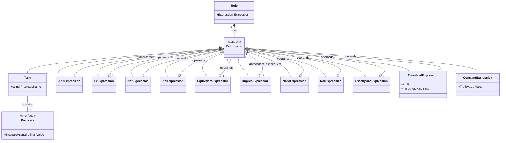

# CONTEXT.md — TruthWeaver

This document is the shared vocabulary and domain model for the
`TruthWeaver` library. Read it before making structural changes to the
engine, and update it when the vocabulary changes. See `docs/adr/` for the
reasoning behind individual decisions, and
[`.scratch/deferred-features`](.scratch/deferred-features/spec.md) for
capabilities intentionally left out of the current design.

## What this is

A general-purpose boolean expression engine for .NET. A **rule** is authored
as text, compiled once into an immutable tree, and evaluated many times
against an application-supplied context. It answers *"is this expression
true right now, for this context?"* — nothing more.

It is not an authorization engine, a workflow engine, or a policy engine.
Those are all things you can *build on top of it* — permission checks
("can the current user do X"), process-flow gating, feature-flag
combination logic — but the engine itself has no opinion about permit/deny,
effects, or side effects. See
[`.scratch/deferred-features`](.scratch/deferred-features/spec.md) for why
an authorization layer is intentionally out of scope.

## Vocabulary

| Term | Definition |
| --- | --- |
| **Rule** | A named, versioned unit of persistence: metadata plus one `Expression`. |
| **Expression** | The boolean tree: operators over terms and sub-expressions. |
| **Predicate** | A registered, reusable implementation — `IPredicate<TContext>` — such as `hasTopping` or `lovesPineapple`. The *function*, not any particular call to it. |
| **Term** | A predicate bound to concrete arguments, e.g. `hasTopping(topping: "greenOlives")`. The tree's leaf node, and the unit of [term identity](#term-identity) and memoization. |
| **Operator** | `AND`, `OR`, `NOT`, `XOR`, `EQUIVALENT` (aliases `IFF`, legacy `XNOR`), `IMPLIES`, `NAND`, `NOR`, `ExactlyOne`, and the threshold family `AtLeast(k)`/`AtMost(k)`/`GreaterThan(k)`/`LessThan(k)`/`Exactly(k)`, plus the constants `True`/`False`/`Unknown` (case-insensitive; printed upper camel). Never called a "gate." Every operator has a `Label`/`Description` exposed via `OperatorInfo.Describe`. |
| **Decision** | The result of evaluating an expression: a `TruthValue` plus any faults recorded along the way, and optionally a trace. |
| **TruthValue** | `True` / `False` / `Unknown` — a dedicated three-valued (Kleene) type, never `bool?`. |
| **Fault** | A predicate failed to produce an answer during one evaluation (exception, timeout, cancellation). Faults become `Unknown`, not thrown exceptions, at the expression level. A predicate that simply returns `Unknown` is a normal answer and records no fault. |
| **CompiledRule** | The immutable, thread-safe result of compiling a rule's text. Safe to cache and share; compile once, evaluate many times. |
| **PredicateRegistry** | Where predicate implementations are registered under a name, with their argument schema. Every predicate carries a required, read-only `Label` and `Description`; every argument carries a required `Description`. |

Avoid these near-synonyms once the term above is established: "term" and
"predicate" are not interchangeable (a predicate is the function; a term is
a bound call to it); "gate" is circuit vocabulary, not used here;
`EvaluationContext` is not a type in this design — the context is just
`TContext`, owned entirely by the application.

## Conceptual model



The same shape, as a grammar:

```text
Rule = Expression

Expression =
      Term
    | AND(Expression, Expression, ...)
    | OR(Expression, Expression, ...)
    | NOT(Expression)
    | XOR(Expression, Expression)          // binary only
    | EQUIVALENT(Expression, Expression)   // binary only; NOT(XOR(...)); aliases IFF, XNOR
    | IMPLIES(Expression, Expression)      // binary only; OR(NOT(antecedent), consequent)
    | NAND(Expression, Expression)         // binary only; NOT(AND(...))
    | NOR(Expression, Expression)          // binary only; NOT(OR(...))
    | ExactlyOne(Expression, Expression, ...)
    | AtLeast(k, Expression, Expression, ...)
    | AtMost(k, Expression, Expression, ...)
    | GreaterThan(k, Expression, Expression, ...)
    | LessThan(k, Expression, Expression, ...)
    | Exactly(k, Expression, Expression, ...)
    | true | false
```

Every expression evaluates to exactly one `TruthValue`. At the API boundary,
a `Decision.IsSatisfied` is `true` only when the result is `True` — `Unknown`
fails closed.

## Term identity

Term identity is what makes memoization, canonical equality, and constant/
contradiction analysis sound — two terms are "the same variable" if and only
if:

- predicate name, normalized case-insensitively to the registered casing, **and**
- arguments, sorted by name, each compared by exact type-normalized value.

Argument **values** are case-**sensitive** (`role: "Y"` and `role: "y"` are
different terms — role codes are frequently case-significant, and folding
them silently would be a security bug in an authorization consumer).
Argument **order** in the source text does not affect identity. Array-valued
arguments **are** order-sensitive.

## Equivalency rules

The operator set above is intentionally closed, not minimal — several
operators (and threshold-family edge values) are semantically equivalent to
a composition of others. These equivalences are recorded here so authors and
reviewers can recognize them, and so the set is never accidentally widened
with an operator that would just be a synonym for one of these:

| Expression | Equivalent to |
| --- | --- |
| `AtMost(0, ...)` | `NOT(OR(...))` (i.e. `NOR`) |
| `Exactly(n, ...)`, where `n` is the operand count | `AND(...)` |
| `Exactly(1, ...)` | `ExactlyOne(...)` |
| `EQUIVALENT(a, b)` (`IFF`, legacy `XNOR`) | `NOT(XOR(a, b))` |
| `IMPLIES(a, b)` | `OR(NOT(a), b)` |
| `NAND(a, b)` | `NOT(AND(a, b))` |
| `NOR(a, b)` | `NOT(OR(a, b))` |
| `GreaterThan(0, ...)` | `OR(...)` |
| `LessThan(n, ...)`, where `n` is the operand count | `NOT(AND(...))` |

> **Superseded in part by [ADR-0005](docs/adr/0005-strong-k3-language-surface.md):** `ANY`/`ALL`/`NONE`/`BETWEEN` become derived cardinality aliases, and `IMPLIES`/symbol aliases are accepted. The paragraph below is the pre-ADR-0005 rationale and is rewritten when ticket `k3-conformance/03` lands.

There are no `All`/`None` operators. `All(...)` would just be `AND(...)`
and `None(...)` would just be `NOT(OR(...))` (see `AtMost(0, ...)` above) —
adding them would mean a second spelling for an existing operator with no
new semantics, the same reasoning [ADR-0003](docs/adr/0003-rule-syntax-and-serialization.md)
already applied when it declined to add `IMPLIES` or symbol aliases
(`&&`, `||`).

These equivalences are documentation, not a normalization pass: the compiler
does not rewrite one form into the other, and both sides of each row remain
independently valid, distinct things a rule author can write. See the
[threshold operator family amendment](docs/adr/0003-rule-syntax-and-serialization.md#threshold-operator-family-supersedes-the-single-atleastk-)
in ADR-0003 for the full `AtLeast`/`AtMost`/`GreaterThan`/`LessThan`/`Exactly`
design this table draws its threshold rows from.

## The predicate-author contract

This is the one rule every predicate implementation must follow, and the one
the whole memoization/simplification/analysis story is unsound without:

> **A predicate must return the same answer for the same [term identity](#term-identity)
> within a single evaluation.**

Nothing broader is claimed or enforced:

- **No cross-evaluation guarantee.** A predicate reading `IOptions<T>` or a
  slowly-changing database row may return a different answer on the *next*
  evaluation. That's fine — memoization is scoped to one evaluation only.
- **Ambient state (clocks, timezones) is the predicate's problem, not the
  engine's.** `IsToday` is just a predicate that happens to read
  `TimeProvider` internally; the engine only ever sees and memoizes its
  `TruthValue` answer. The engine does not claim overall determinism across time.
- **IO volume and sequencing inside a predicate is the predicate author's
  responsibility.** The engine will not fan out or batch calls on a
  predicate's behalf; a predicate that makes 40 sequential HTTP calls is a
  predicate-authoring problem, not an engine problem.

See [ADR-0002](docs/adr/0002-evaluation-semantics.md) for the full
evaluation model this contract supports.

## Failure model (summary)

Internally three-valued (Kleene), two-valued at the boundary. A predicate
may answer `Unknown` directly (no fault) and signals a failure by throwing; the evaluator catches it, records a `Fault`
(predicate identity + exception), and treats the term as `Unknown` rather
than aborting evaluation. Evaluation continues wherever the logic can still
reach a determinate answer (`Unknown OR True` is `True`), because a fault
that can't affect the outcome shouldn't turn a transient blip into a denial.
Full reasoning and the truth tables: [ADR-0001](docs/adr/0001-kleene-failure-model.md).

## Compilation and persistence (summary)

`Compile` never throws for authoring errors; it returns a `CompilationResult`
of a nullable `CompiledRule` plus a list of diagnostics (code, severity,
source span). **Nothing that fails compilation is ever persisted** — the
write path treats diagnostics as form-validation messages, and a rejected
save leaves the previously persisted rule active. `CompiledRule` is
immutable, so runtime rule changes are a compile-and-swap-a-reference: no
locking, in-flight evaluations finish against the old rule. Full reasoning:
[ADR-0002](docs/adr/0002-evaluation-semantics.md).

The analyzer step reasons in Strong K3 too (dual-rail BDD: "definitely true" /
"possibly true"). It warns (`BRE0012` tautology, `BRE0013` contradiction) only
when a sub-expression is `True` (resp. `False`) for every
`{True, False, Unknown}` assignment of its terms, so `A AND NOT A` and
`A OR NOT A` are not reported: both are `Unknown` when `A` is.
([ADR-0005](docs/adr/0005-strong-k3-language-surface.md) decision 17.)

## Syntax and serialization (summary)

The string DSL (word operators, plus the symbol aliases `&&`, `||`, `!`, `∧`, `∨`,
`¬`, `⊕`, `→` that compile to the same nodes and are never printed; `NOT > AND > OR` precedence, every infix operator other than `NOT`/`AND`/`OR`
never mixed with `AND`/`OR` or with a different infix operator without parentheses) is
canonical and is what gets persisted. JSON and YAML are interchange/tooling
formats that compile to the same AST and round-trip losslessly with the DSL.
A rule can also be assembled programmatically via `RuleBuilder`
(`TruthWeaver.Building`), which renders to the same JSON tree shape
and compiles through the identical pipeline. The JSON tree shape is also
published as a JSON Schema document,
[`rule-tree.schema.json`](src/TruthWeaver/Json/rule-tree.schema.json),
shipped as a content asset in the `TruthWeaver` package. Full grammar
and schema: [ADR-0003](docs/adr/0003-rule-syntax-and-serialization.md).

## Package boundaries (summary)

`TruthWeaver.Abstractions` (the kernel: `IPredicate<TContext>`,
argument schema, `TruthValue`, `Decision` — zero dependencies, shared across
projects that only *implement* predicates), `TruthWeaver` (AST,
parser, compiler, analyzer, evaluator, System.Text.Json support, DI
extensions), `TruthWeaver.Yaml` (YamlDotNet only). Full reasoning:
[ADR-0004](docs/adr/0004-package-boundaries-and-extensibility.md).

## AOT / trim compatibility

Trimming/AOT is a design constraint rather than an afterthought here, so
it's verified rather than assumed. `src/Directory.Build.props` sets
`IsAotCompatible` for every shipping package (`TruthWeaver.Abstractions`,
`TruthWeaver`, `TruthWeaver.Predicates`, `TruthWeaver.Testing`,
`TruthWeaver.Yaml`), enabling both the trim analyzer (`IL2xxx`) and the NativeAOT
analyzer (`IL3xxx`), and CI (`.github/workflows/ci.yml`) promotes their warnings to build
errors. As of this writing that analysis is clean: zero trim/AOT warnings across all five
packages.

This holds by construction, not by suppression:

- The rule tree's JSON support (`TruthWeaver/Json`) reads and writes `JsonElement`/
  `JsonNode`/`JsonObject`/`JsonArray` directly — never `JsonSerializer.Deserialize<T>` — so
  there is no reflection-based (de)serialization to source-generate around.
- The DI registration extension (`AddTruthWeaver<TContext>`) registers a
  closed-generic instance and a factory delegate, not an open-generic or reflection-driven
  registration.
- No production code path uses `Activator.CreateInstance`, `MakeGenericMethod`, assembly
  scanning, or runtime code generation (`System.Reflection.Emit`, `Expression.Compile`, etc.).

**Known limitation — YamlDotNet:** `TruthWeaver.Yaml` only depends on YamlDotNet's
low-level `RepresentationModel` DOM (`YamlStream`/`YamlNode`), not its reflection-based
object-graph (de)serializer, so nothing in this package's own code triggers a trim/AOT
warning today. However, YamlDotNet 18.1.0 does not itself ship `IsTrimmable`/AOT annotations
(no `ILLink` metadata in its NuGet package), so the trim/AOT analyzer can't see into it and
verify its internals — a real incompatibility inside YamlDotNet's own reflection paths would
not surface as a build warning here. `TruthWeaver.Yaml` is trim/AOT-*analyzed* clean,
not independently *proven* safe end-to-end; a consumer publishing with `PublishAot`/
`PublishTrimmed` who reaches this package should smoke-test that specific scenario.

No dedicated `PublishAot` smoke-test host was added: `PublishAot`/`PublishTrimmed` are
publish-time settings for an executable, and none of these five packages is one. The
build-time analyzer (`IsAotCompatible`) is the correct and sufficient check for a library —
it's the same mechanism the .NET runtime's own libraries use to stay AOT-compatible without
publishing themselves.

## Related documents

- [ADR-0001: Kleene failure model](docs/adr/0001-kleene-failure-model.md)
- [ADR-0002: Evaluation semantics](docs/adr/0002-evaluation-semantics.md)
- [ADR-0003: Rule syntax and serialization](docs/adr/0003-rule-syntax-and-serialization.md)
- [ADR-0004: Package boundaries and extensibility](docs/adr/0004-package-boundaries-and-extensibility.md)
- [README.md](README.md)
