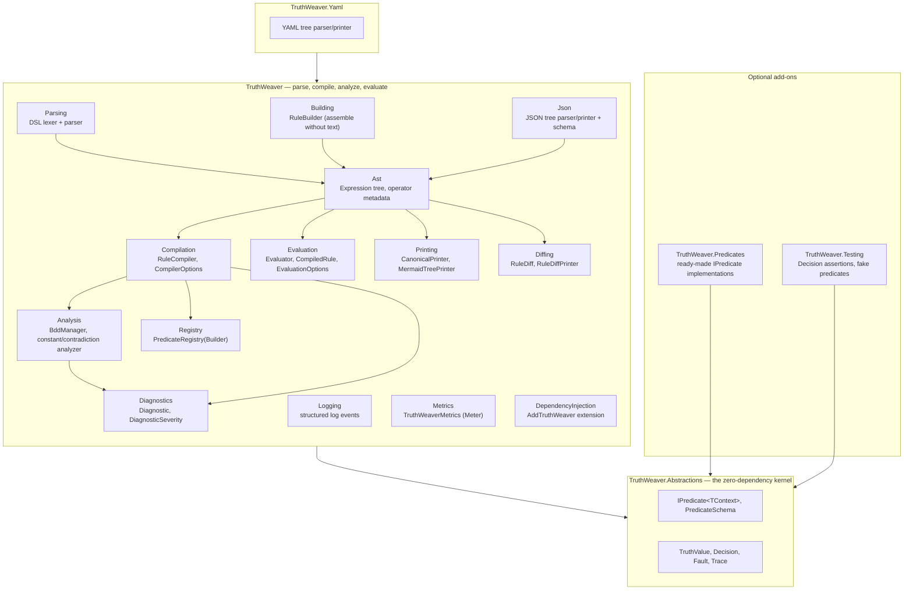
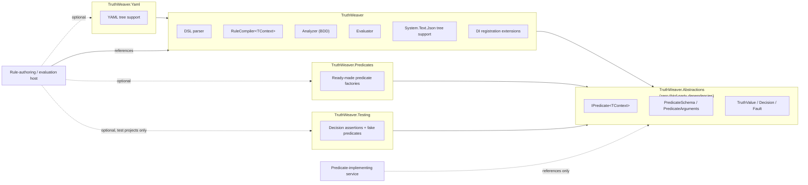
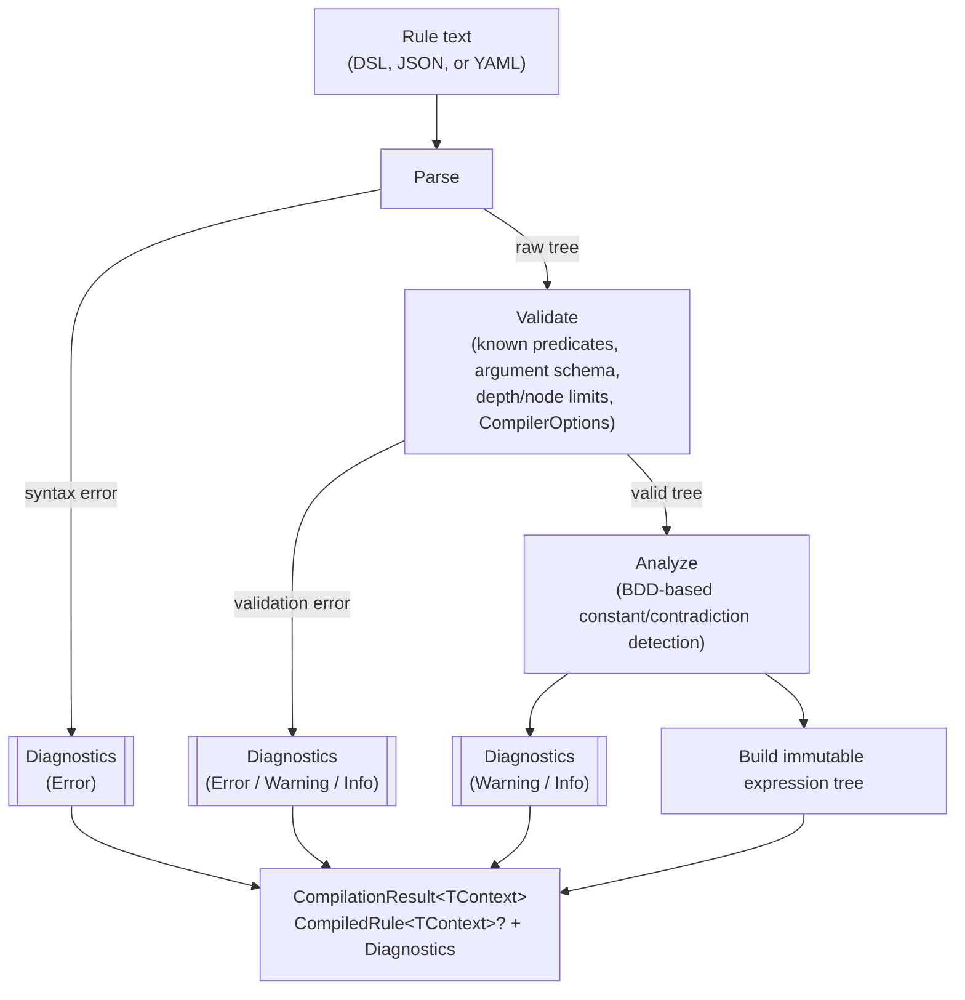

# TruthWeaver

[](https://github.com/rheone/TruthWeaver/actions/workflows/ci.yml)

[](global.json)
[](LICENSE)

A general-purpose boolean expression engine for .NET. Author a rule once as
text, compile it into an immutable tree, and evaluate it many times against
whatever application context you supply — a user, a request, a resource, or
anything else.

> [!NOTE]
> This is a proof of concept. The design and rationale behind every decision
> below live in [CONTEXT.md](CONTEXT.md) and [docs/adr/](docs/adr/) — read
> those before making structural changes. There is no published NuGet
> package yet (`Version` is `1.0.0-dev`); build from source.

<details>
<summary><strong>Table of contents</strong></summary>

- [Requirements](#requirements)
- [Getting started](#getting-started)
- [Features](#features)
- [A tour of the codebase](#a-tour-of-the-codebase)
- [What it is (and isn't)](#what-it-is-and-isnt)
- [Operators](#operators)
  - [Order of operations](#order-of-operations)
  - [Binary vs. unary operators](#binary-vs-unary-operators)
  - [All operators](#all-operators)
- [Packages](#packages)
- [Choosing a rule format](#choosing-a-rule-format)
- [Predicate types](#predicate-types)
- [Examples](#examples)
- [Building rules programmatically](#building-rules-programmatically)
  - [Converting between DSL, JSON, and YAML](#converting-between-dsl-json-and-yaml)
  - [`RuleBuilder` reference](#rulebuilder-reference)
  - [Describing a compiled rule](#describing-a-compiled-rule)
  - [Rendering a rule as a diagram](#rendering-a-rule-as-a-diagram)
- [Evaluation flow](#evaluation-flow)
- [Compilation pipeline](#compilation-pipeline)
- [Glossary](#glossary)
- [Appendix: Truth tables](#appendix-truth-tables)
- [Benchmarks](#benchmarks)
- [Design documents](#design-documents)
- [License](#license)

</details>

## Requirements

Building from source needs at least the SDK version floor in
[`global.json`](global.json) — currently `11.0.100-rc.1.26425.128` — but
`rollForward: latestMajor` with `allowPrerelease: true` means any later
major .NET SDK on the machine, preview or RC included, is accepted. This
isn't a pin to that exact patch.

## Getting started

1. **Reference the packages you need.** A service that only *implements*
   predicates references `TruthWeaver.Abstractions`; a host that
   authors and evaluates rules references `TruthWeaver` (and
   `TruthWeaver.Yaml` if it wants YAML too). See
   [Packages](#packages) below.

   ```xml
   <ProjectReference Include="..\TruthWeaver\TruthWeaver.csproj" />
   ```

2. **Implement a predicate.** A zero-argument predicate is the simplest
   shape — a class implementing `IPredicate<TContext>`:

   ```csharp
   public sealed class IsManager : IPredicate<User>
   {
       public static PredicateSchema Schema =>
           PredicateSchema.NoArguments("isManager", "Is Manager", "Does the current user hold the manager role?");

       public ValueTask<bool> EvaluateAsync(User user, PredicateArguments args, CancellationToken ct) =>
           ValueTask.FromResult(user.IsManager);
   }
   ```

3. **Register it and compile a rule:**

   ```csharp
   PredicateRegistry<User> registry = PredicateRegistry<User>.CreateBuilder().Add<IsManager>().Build();
   RuleCompiler<User> compiler = new(registry);
   CompilationResult<User> result = compiler.Compile("isManager");

   if (!result.Succeeded)
   {
       // result.Diagnostics explains why - surface it to whoever authored the rule.
       return;
   }
   ```

4. **Evaluate it against a context:**

   ```csharp
   Decision decision = await result.CompiledRule!.EvaluateAsync(user, serviceProvider, cancellationToken: ct);

   if (decision.IsSatisfied)
   {
       // allowed
   }
   ```

That's the whole lifecycle: implement → register → compile once → evaluate
many times. [A tour of the codebase](#a-tour-of-the-codebase) below maps
that lifecycle onto the actual folders, and [Examples](#examples) builds up
from here to named arguments, the full operator set, and the full ADR-0003
worked example in DSL, JSON, and YAML.

## Features

- **Kleene three-valued logic.** Every operator follows the three-valued
  truth tables in [ADR-0001](docs/adr/0001-kleene-failure-model.md) (full
  tables: [Appendix](#appendix-truth-tables)) — a predicate fault becomes
  `Unknown`, never a thrown exception or a silently coerced `false`. Entry
  point: [`Evaluator`](src/TruthWeaver/Evaluation/Evaluator.cs).
- **Per-evaluation memoization.** A term referenced from multiple branches
  of the same rule is invoked at most once per evaluation, keyed by
  structural term identity (see [CONTEXT.md#term-identity](CONTEXT.md#term-identity)).
  Entry point: [`Evaluator`](src/TruthWeaver/Evaluation/Evaluator.cs).
- **A BDD-based analyzer**, not brute-force truth tables, flags structurally
  constant or contradictory sub-expressions (e.g.
  `hasRole(role: "Y") AND NOT hasRole(role: "Y")`) as compile diagnostics.
  Entry point: [`Analyzer`](src/TruthWeaver/Analysis/Analyzer.cs) and
  [`BddManager`](src/TruthWeaver/Analysis/BddManager.cs).
- **Resource limits and `CompilationMode.Lenient`.** `CompilerOptions`
  bounds tree depth, node count, and the analyzer's term cap so an
  admin-authored rule can't hang a request thread; `Lenient` mode compiles
  an unregistered predicate to a permanent `Unknown` term instead of an
  error. Entry point: [`CompilerOptions`](src/TruthWeaver/Compilation/CompilerOptions.cs).
- **`EvaluationOptions`**: an opt-in `FaultBudget` for fail-fast behavior
  during a known outage, an `Exhaustive` mode that runs every reachable term
  without changing the result, and an overall evaluation timeout linked into
  the caller's `CancellationToken`. Entry point:
  [`EvaluationOptions`](src/TruthWeaver/Evaluation/EvaluationOptions.cs).
- **Scoped DI resolution.** Class-based predicates resolve fresh from the
  `IServiceProvider` supplied to each evaluation call, so a predicate with a
  scoped dependency works correctly even though a `CompiledRule<TContext>`
  is long-lived and shared. Entry point:
  [`TruthWeaverServiceCollectionExtensions`](src/TruthWeaver/DependencyInjection/TruthWeaverServiceCollectionExtensions.cs).
- **Structured logging and metrics.** Faults, compile diagnostics, and
  rule-swap notifications log as structured events through `ILogger<T>`; a
  `"TruthWeaver"` `Meter` exposes counters for evaluations, faults, and
  compile diagnostics, observable through OpenTelemetry's `AddMeter` with no
  new dependency. Entry points: [`src/TruthWeaver/Logging`](src/TruthWeaver/Logging)
  and [`TruthWeaverMetrics`](src/TruthWeaver/Metrics/TruthWeaverMetrics.cs).
- **Structural rule diffing.** `RuleDiff.Compare` compares two compiled
  rules and reports which operator, term, or constant nodes were added,
  removed, or changed, each located by operand-index path and paired with a
  human-readable description — useful for "what did this edit actually
  change" tooling. Entry point:
  [`RuleDiff`](src/TruthWeaver/Diffing/RuleDiff.cs).
- **Diagram rendering.** A compiled rule renders as a Mermaid flowchart,
  optionally colored by one evaluation's result and short-circuit path — see
  [Rendering a rule as a diagram](#rendering-a-rule-as-a-diagram). Entry
  point: [`MermaidTreePrinter`](src/TruthWeaver/Printing/MermaidTreePrinter.cs).
- **Ready-made predicates.** `TruthWeaver.Predicates` ships generic
  string-comparison, null/empty, set-equality, and regex-matching predicate
  factories so common checks don't need a hand-written class. Entry point:
  [`src/TruthWeaver.Predicates`](src/TruthWeaver.Predicates).
- **Test support.** `TruthWeaver.Testing` ships fluent `Decision`
  assertions and fake/scripted predicate factories (fixed answer, simulated
  fault, sequenced answers) for testing without a hand-written
  `IPredicate<TContext>` per test. Entry point:
  [`src/TruthWeaver.Testing`](src/TruthWeaver.Testing).

## A tour of the codebase

The five `src` projects mirror the rule lifecycle from
[Getting started](#getting-started): a predicate-implementing service only
needs the zero-dependency kernel, while a rule-authoring host pulls in the
parser, compiler, analyzer, and evaluator.



Starting points for common tasks:

| Task | Start here |
| --- | --- |
| Implement a new predicate | [`IPredicate<TContext>`](src/TruthWeaver.Abstractions/IPredicate.cs), or a factory in [`TruthWeaver.Predicates`](src/TruthWeaver.Predicates) if it's a generic string/collection/regex check |
| Register predicates and compile a rule | [`PredicateRegistryBuilder`](src/TruthWeaver/Registry/PredicateRegistryBuilder.cs), [`RuleCompiler`](src/TruthWeaver/Compilation/RuleCompiler.cs) |
| Understand DSL parsing | [`Lexer`](src/TruthWeaver/Parsing/Lexer.cs) → [`DslParser`](src/TruthWeaver/Parsing/DslParser.cs) |
| Understand the compiled tree shape | [`Expression`](src/TruthWeaver/Ast/Expression.cs) |
| Understand constant/contradiction detection | [`BddManager`](src/TruthWeaver/Analysis/BddManager.cs), [`Analyzer`](src/TruthWeaver/Analysis/Analyzer.cs) |
| Understand evaluation and short-circuiting | [`Evaluator`](src/TruthWeaver/Evaluation/Evaluator.cs), [`CompiledRule`](src/TruthWeaver/Evaluation/CompiledRule.cs) |
| Assemble a rule without hand-writing text | [`RuleBuilder`](src/TruthWeaver/Building/RuleBuilder.cs) |
| Print or diagram a compiled rule | [`CanonicalPrinter`](src/TruthWeaver/Printing/CanonicalPrinter.cs), [`MermaidTreePrinter`](src/TruthWeaver/Printing/MermaidTreePrinter.cs) |
| Diff two compiled rules | [`RuleDiff`](src/TruthWeaver/Diffing/RuleDiff.cs) |
| Wire into a DI container | [`TruthWeaverServiceCollectionExtensions`](src/TruthWeaver/DependencyInjection/TruthWeaverServiceCollectionExtensions.cs) |
| Compile JSON or YAML instead of the DSL | [`JsonTreeParser`](src/TruthWeaver/Json/JsonTreeParser.cs), [`YamlTreeParser`](src/TruthWeaver.Yaml/YamlTreeParser.cs) |
| Write a unit test against a `Decision` | [`DecisionAssertions`](src/TruthWeaver.Testing/DecisionAssertions.cs), [`FakePredicates`](src/TruthWeaver.Testing/FakePredicates.cs) |

Beyond `src`, the rest of the repository:

- [`tests/TruthWeaver.Tests`](tests/TruthWeaver.Tests) — unit tests for all
  five packages, one file per behavior area (parsing, compilation,
  evaluation, memoization, YAML/JSON round-tripping, diffing, and so on).
- [`benchmarks/TruthWeaver.Benchmarks`](benchmarks/TruthWeaver.Benchmarks) —
  a BenchmarkDotNet suite measuring compile-time and evaluation-time cost
  (dev-only; see [Benchmarks](#benchmarks)).
- [`docs/adr/`](docs/adr/) — the architecture decision records behind every
  major design choice.
- [`CONTEXT.md`](CONTEXT.md) — the domain vocabulary and conceptual model,
  kept in sync with the code.

## What it is (and isn't)

`TruthWeaver` answers one question: *is this expression true right
now, for this context?* It knows about `AND`, `OR`, `NOT`, `XOR`, `XNOR`,
`ExactlyOne`, the threshold family (`AtLeast`/`AtMost`/`GreaterThan`/
`LessThan`/`Exactly`), terms, and evaluation. It does not know about
permissions, workflows, or policies — those are things you build *on top* of
it. A permission check ("can the current user do X") is one consumer of this
engine, not what the engine itself is.

| Concept | Meaning |
| --- | --- |
| **Rule** | A named unit of persistence: metadata + one expression. |
| **Expression** | The boolean tree — operators over terms and sub-expressions. |
| **Predicate** | A registered, reusable implementation, e.g. `hasRole`, `isManager`. |
| **Term** | A predicate bound to concrete arguments, e.g. `hasRole(role: "Y")` — the tree's leaf node. |
| **Operator** | `AND` `OR` `NOT` `XOR` `XNOR` `ExactlyOne` and the threshold family (`AtLeast(k)`/`AtMost(k)`/`GreaterThan(k)`/`LessThan(k)`/`Exactly(k)`), plus `true`/`false`. See [Operators](#operators) below. |
| **Decision** | The evaluation result: a `TruthValue` plus any faults, and optionally a trace. |

Full vocabulary and the predicate-author contract: [CONTEXT.md](CONTEXT.md).

## Operators

### Order of operations

Precedence governs *parsing* the DSL only — the canonical printer always
disambiguates explicitly (see [below](#choosing-a-rule-format)), so a
persisted or printed rule never depends on a reader holding this table in
their head.

1. **Parentheses** (`(...)`) — always evaluated first, exactly as written.
2. **`NOT`** — binds tightest of the operators; right-associative (`NOT NOT
   a` is valid, if odd).
3. **`AND`** — binds tighter than `OR`.
4. **`OR`** — binds loosest of the infix operators.

`isManager AND NOT isSuspended OR isAdmin` therefore parses as
`(isManager AND (NOT isSuspended)) OR isAdmin`.

`XOR` and `XNOR` are **not** part of this precedence chain: mixing either of
them with `AND`/`OR`, or mixing `XOR` with `XNOR`, at the same syntactic
level without explicit parentheses is a **compile error**
(`AmbiguousOperatorMixing`) rather than resolved by an implicit precedence
guess — see [ADR-0003](docs/adr/0003-rule-syntax-and-serialization.md) for
why. Function-call-style operators (`ExactlyOne(...)` and the threshold
family) are self-delimiting — their parentheses are part of the call syntax,
not grouping, so they never participate in precedence at all.

### Binary vs. unary operators

| Arity | Operators | Notes |
| --- | --- | --- |
| **Unary** | `NOT` | Takes exactly one operand. |
| **Binary only** | `XOR`, `XNOR` | Always exactly two operands — a compile error otherwise (`XorArityViolation`). Deliberately not generalized to n-ary parity; see [ADR-0003](docs/adr/0003-rule-syntax-and-serialization.md). |
| **N-ary (≥ 2)** | `AND`, `OR`, `ExactlyOne`, `AtLeast`, `AtMost`, `GreaterThan`, `LessThan`, `Exactly` | Take two or more operands. `AND`/`OR` are commonly thought of as "binary" from C-family languages, but this engine treats them as flat n-ary chains (`AND(a, b, c)`, not `AND(AND(a, b), c)`). |
| **0-ary** | `true`, `false` | Constants, not operators over operands. |

### All operators

| Operator | Arity | Description |
| --- | --- | --- |
| `AND` | n-ary | True iff every operand is true. Short-circuits at the first `False`. |
| `OR` | n-ary | True iff at least one operand is true. Short-circuits at the first `True`. |
| `NOT` | unary | Logical negation. `Unknown` stays `Unknown`. |
| `XOR(a, b)` | binary | True iff exactly one of the two operands is true. `Unknown` if either operand is `Unknown`. |
| `XNOR(a, b)` | binary | Logical biconditional (`IFF`) — true iff both operands agree (both true or both false). The negation of `XOR`. |
| `ExactlyOne(...)` | n-ary | True iff exactly one operand is true — the unambiguous name for what `XOR` only means at exactly two operands. |
| `AtLeast(k, ...)` | n-ary | True iff at least `k` operands are true. |
| `AtMost(k, ...)` | n-ary | True iff at most `k` operands are true. |
| `GreaterThan(k, ...)` | n-ary | True iff more than `k` operands are true. |
| `LessThan(k, ...)` | n-ary | True iff fewer than `k` operands are true. |
| `Exactly(k, ...)` | n-ary | True iff exactly `k` operands are true. |
| `true` / `false` | constant | Fixed truth value, useful for stubbing out incomplete logic. |

Every operator above follows the three-valued Kleene truth tables in
[ADR-0001](docs/adr/0001-kleene-failure-model.md) — see the
[truth table appendix](#appendix-truth-tables) for the full tables.

## Packages

| Package | Depends on | Ships |
| --- | --- | --- |
| `TruthWeaver.Abstractions` | *(nothing third-party)* | `IPredicate<TContext>`, `PredicateSchema`, `PredicateArguments`, `TruthValue`, `Decision`, `Fault` — everything a predicate-implementing service needs. |
| `TruthWeaver` | `Abstractions`, `Microsoft.Extensions.DependencyInjection.Abstractions`, `Microsoft.Extensions.Logging.Abstractions` | The DSL parser, `RuleCompiler<TContext>`, `CompiledRule<TContext>`, the BDD-based analyzer, the evaluator, `System.Text.Json` tree support, printing/diffing, and DI registration extensions. |
| `TruthWeaver.Yaml` | `TruthWeaver`, YamlDotNet | YAML tree support (`CompileYaml`/`PrintYaml`), isolated so a consumer with no interest in YAML never pulls in YamlDotNet. |
| `TruthWeaver.Predicates` | `TruthWeaver.Abstractions` | Ready-made generic `IPredicate<TContext>` factories — string comparison, null/empty, set equality, regex matching, and externally-resolved-value predicates for a safe-to-share resolving client — for a consumer that wants common checks without writing a class, and without acquiring the parser, compiler, or analyzer. |
| `TruthWeaver.Testing` | `TruthWeaver.Abstractions` | Fluent `Decision` assertions and fake/scripted predicate factories for tests, without a hand-written `IPredicate<TContext>` per test. |



A service that only *implements* domain predicates references
`Abstractions` alone — no parser, no BDD analyzer, no YAML library. See
[ADR-0004](docs/adr/0004-package-boundaries-and-extensibility.md).

## Choosing a rule format

DSL, JSON, and YAML compile to the exact same tree through the exact same
Parse → Validate → Analyze → Build pipeline (see
[Compilation pipeline](#compilation-pipeline) below) — none of them is more
"real" than another at evaluation time. What differs is who's meant to
write and read each one:

| | DSL string | JSON tree | YAML tree |
| --- | --- | --- | --- |
| **Canonical / persisted form?** | Yes — this is what a `CompiledRule<TContext>` prints back to. | No — an interchange format. | No — an interchange format. |
| **Best for** | A human author or reviewer typing/reading a rule directly (a database column, a code review, a log line). | A UI rule builder generating or consuming a tree without writing a parser. | The same as JSON, when the host's tooling already prefers YAML (config files, GitOps). |
| **Package** | `TruthWeaver` | `TruthWeaver` | `TruthWeaver.Yaml` |
| **Compile with** | `compiler.Compile(text)` | `compiler.CompileJson(json)` | `compiler.CompileYaml(yaml)` |
| **Print with** | `rule.CanonicalText` | `rule.PrintJson()` | `rule.PrintYaml()` |
| **Round-trips losslessly?** | Yes, by definition. | Yes — `parse(print(x))` is structurally equal to `x` (ticket 07). | Yes — same guarantee (ticket 08). |
| **Nesting for `AND`/`OR`/`XOR`/`XNOR`** | Infix with precedence (see [Operators](#operators)); `XOR`/`XNOR` mixed with `AND`/`OR`, or with each other, needs explicit parens. | Explicit `{"op": "...", "operands": [...]}` nodes — no precedence to get wrong. | Same explicit `op`/`operands` shape as JSON. |
| **Comments** | No | No (JSON has none) | Yes (`#`) — a practical reason to prefer YAML for hand-maintained rule files. |

See [ADR-0003](docs/adr/0003-rule-syntax-and-serialization.md) for the full
grammar and tree schema. There's also a fourth way to produce a rule without
writing text in any of these formats by hand — see
[Building rules programmatically](#building-rules-programmatically) below.

A fifth format, of sorts: `CanonicalText` isn't merely "minimal" — it
parenthesizes an operand whenever it's a different operator than the one
it's nested under (e.g. `a AND b OR c` prints as `(a AND b) OR c`), even
where precedence alone already makes the parse unambiguous. The goal is a
rule that reads clearly at a glance without the reader reconstructing
precedence mentally, not merely one that reparses correctly.

## Predicate types

Every predicate is one of four registration shapes, and they mix freely
within one `PredicateRegistryBuilder<TContext>.Build()`. Two independent
axes: **how many rule-authored arguments** it takes (zero, one, or several —
"n"), and **where its implementation comes from** (a stateless lambda, or a
class resolved from DI).

| Shape | Arguments | Implementation | When to use |
| --- | --- | --- | --- |
| Lambda, 0 args | none | stateless delegate | A simple stateless check with no rule-authored parameter. |
| Lambda, 1 arg | one | stateless delegate with a 1-argument schema | The common case — a stateless check parameterized by the rule text, e.g. `hasRole(role: "Y")`. |
| Class-based (DI), 0 args | none | `IPredicate<TContext>` | Needs a scoped/injected dependency but no rule-authored parameter. |
| Class-based (DI), n args | several | `IPredicate<TContext>` with a multi-argument schema | Needs both rule-authored parameters *and* one or more injected dependencies. |

Before writing one by hand, check whether
[`TruthWeaver.Predicates`](src/TruthWeaver.Predicates) already has it —
`StringPredicates`, `CollectionPredicates`, and `RegexPredicates` cover
string comparison, null/empty checks, set equality, and regex matching as
generic factories parameterized by a value selector, and
`ResolvedValuePredicates` covers the externally-resolved-value pattern
(below) for a safe-to-share resolving client.

### 0 arguments, stateless lambda

```csharp
.Add(
    PredicateSchema.NoArguments("isSuspended", "Is Suspended", "Is the current user's account suspended?"),
    (user, args, ct) => ValueTask.FromResult(user.IsSuspended))
```

### 1 argument, stateless lambda

See [Example 3](#3-named-arguments)'s `hasRole(role: "Y")` — a single named
`string` argument, no injected dependency.

### 0 arguments, class-based (DI)

See [Example 1](#1-a-single-predicate)'s `IsManager` — a class implementing
`IPredicate<TContext>`, resolved fresh from `IServiceProvider` on every
evaluation (the right shape whenever a scoped dependency, e.g. a
`DbContext`, is involved, even with no rule-authored parameter).

### n arguments, class-based, multiple injected dependencies

The shape that combines everything: two rule-authored arguments *and* two
constructor-injected dependencies, resolved from DI per evaluation:

```csharp
public sealed class HasEnoughRecentApprovals : IPredicate<Resource>
{
    private readonly IApprovalStore approvals;
    private readonly TimeProvider clock;

    public HasEnoughRecentApprovals(IApprovalStore approvals, TimeProvider clock)
    {
        this.approvals = approvals;
        this.clock = clock;
    }

    public static PredicateSchema Schema =>
        new(
            "hasEnoughRecentApprovals",
            "Has Enough Recent Approvals",
            "Has the resource received at least the given number of approvals within the given time window?",
            [
                new PredicateArgumentSchema("minCount", "The minimum number of approvals required.", LiteralKind.Int64),
                new PredicateArgumentSchema("withinHours", "The lookback window, in hours.", LiteralKind.Int64),
            ]);

    public async ValueTask<bool> EvaluateAsync(Resource resource, PredicateArguments args, CancellationToken ct)
    {
        long minCount = args.GetInt64("minCount");
        long withinHours = args.GetInt64("withinHours");
        DateTimeOffset cutoff = this.clock.GetUtcNow().AddHours(-withinHours);

        long count = await this.approvals.CountApprovalsSinceAsync(resource.Id, cutoff, ct);
        return count >= minCount;
    }
}
```

Used in a rule as `hasEnoughRecentApprovals(minCount: 2, withinHours: 24)`.
`IApprovalStore` might be scoped (an `IDbContextFactory`-backed store) and
`TimeProvider` is typically a singleton — both resolve correctly on every
evaluation because the predicate itself is resolved fresh from
`IServiceProvider`, not constructed once at registration.

Wiring it up: **`AddTruthWeaver` registers the registry and compiler,
not the predicate types themselves** — a class-based predicate (and its own
dependencies) must be registered in the host's container separately, same
as any other DI service:

```csharp
services.AddScoped<IApprovalStore, ApprovalStore>();
services.AddSingleton(TimeProvider.System);
services.AddScoped<HasEnoughRecentApprovals>();      // the predicate type itself
services.AddScoped<IsManager>();

services.AddTruthWeaver<Resource>(builder => builder
    .Add<IsManager>()
    .Add<HasEnoughRecentApprovals>());
```

Both lambda and class-based predicates register against the same
`PredicateRegistryBuilder<TContext>.Add(...)` overloads — the difference is
purely dependency lifetime and how many rule-authored arguments the schema
declares, never a difference in rule text or how the compiler validates a
term. See
[ADR-0002](docs/adr/0002-evaluation-semantics.md#predicate-registration-and-dependency-lifetimes).

### n arguments, class-based, externally-resolved value

`HasEnoughRecentApprovals` above injects a dependency to read a value it
already knows how to interpret (`minCount`, `withinHours` are values, used
directly). A related but distinct shape: a rule-text literal argument and/or
a `TContext`-supplied value is a **key to be resolved** — not a value
already ready to use — and a constructor-injected service performs that
live resolution before the predicate can answer anything. There is no
single canonical shape here; it covers three distinct cases, none more
central than the others:

1. **Single-value, no comparison target.** The literal key resolves
   directly to the boolean answer — there's no "other side" to compare
   against, and `TContext` may not be read at all. A feature-flag check is
   the classic instance:

   ```csharp
   public sealed class IsFeatureEnabled(IFeatureFlagService flags) : IPredicate<object?>
   {
       public static PredicateSchema Schema =>
           new(
               "isFeatureEnabled",
               "Is Feature Enabled",
               "Is the given feature flag currently enabled, resolved live from the flag service?",
               [new PredicateArgumentSchema("flagKey", "The feature flag key to look up.", LiteralKind.String)]);

       public ValueTask<bool> EvaluateAsync(object? context, PredicateArguments args, CancellationToken ct) =>
           flags.IsEnabledAsync(args.GetString("flagKey"), ct);
   }
   ```

   Used in a rule as `isFeatureEnabled(flagKey: "new-checkout")`.

2. **Single-sided value check.** One side — the argument or a context
   value — is resolved live; the other side is a plain value already
   sitting on `TContext`, needing no resolution of its own. Note that
   `TContext` here has no user field at all — this pattern isn't about "the
   current user," it's about a key that needs a live lookup:

   ```csharp
   public sealed class IsWithinBudget(IBudgetLookupService budget) : IPredicate<PurchaseRequest>
   {
       public static PredicateSchema Schema =>
           new(
               "isWithinBudget",
               "Is Within Budget",
               "Is the request's amount within the live spending limit resolved for the given cost center code?",
               [new PredicateArgumentSchema("costCenterCode", "The cost center code to look up a live limit for.", LiteralKind.String)]);

       public async ValueTask<bool> EvaluateAsync(PurchaseRequest request, PredicateArguments args, CancellationToken ct)
       {
           string costCenterCode = args.GetString("costCenterCode");
           decimal limit = await budget.ResolveLimitAsync(costCenterCode, ct);
           return request.Amount <= limit;
       }
   }
   ```

   Used in a rule as `isWithinBudget(costCenterCode: "CC-100")`. Only
   `costCenterCode` is resolved; `request.Amount` is read straight off
   `TContext`, no lookup needed.

3. **Two-sided comparison.** Both a `TContext`-supplied anchor and the
   rule-text argument are independently resolved through the injected
   service, and the two *resolved* results are compared — the original
   motivating case (a relationship check), but only one instance of this
   family, not the pattern itself:

   ```csharp
   public sealed class IsManagedByCandidate(IManagerLookupService managers) : IPredicate<Resource>
   {
       public static PredicateSchema Schema =>
           new(
               "isManagedByCandidate",
               "Is Managed By Candidate",
               "Does the resource's actual manager, resolved live, match the given candidate?",
               [new PredicateArgumentSchema("candidateManagerId", "The candidate manager to validate.", LiteralKind.Guid)]);

       public async ValueTask<bool> EvaluateAsync(Resource resource, PredicateArguments args, CancellationToken ct)
       {
           Guid candidateManagerId = args.GetGuid("candidateManagerId");
           Guid actualManagerId = await managers.ResolveManagerIdAsync(resource.ResourceId, ct);
           return actualManagerId == candidateManagerId;
       }
   }
   ```

   Used in a rule as
   `isManagedByCandidate(candidateManagerId: "3fa85f64-5717-4562-b3fc-2c963f66afa6")`.
   `resource` (the context) is a resource id, not "the current user" — it
   needs its own resolution just as much as the argument does. Neither side
   of a two-sided comparison is privileged as "the identity one."

A few things stay true across all three shapes:

- The rule-text argument is a **key**, not necessarily an identity — a
  `String` cost-center code is exactly as valid a key as a `Guid`. Whatever
  it resolves to plays no role in the DSL, JSON, or YAML surface; it exists
  only inside `EvaluateAsync`.
- `TContext` participation is optional. Shape 1 above never reads it at
  all; shapes 2 and 3 read it, but nothing about this pattern requires that.
- Term identity ([CONTEXT.md#term-identity](CONTEXT.md#term-identity)) is
  unaffected: the literal argument is still compared as an ordinary literal
  for memoization purposes. What it resolves to on any given evaluation
  never enters term identity. The predicate-author contract
  ([CONTEXT.md#the-predicate-author-contract](CONTEXT.md#the-predicate-author-contract))
  still applies — the same argument plus the same context within *one*
  evaluation must yield the same answer, so a resolution service that's
  internally consistent within a single evaluation (even if the underlying
  data could change between evaluations) is what the contract expects.
- Because the live call happens inside `EvaluateAsync`, a lookup failure
  (timeout, connection error) is absorbed the same way any other predicate
  fault is — as a `Fault` and `TruthValue.Unknown` (ADR-0001), never an
  unhandled exception. No special handling is needed in the predicate
  itself; see [`IPredicate<TContext>`](src/TruthWeaver.Abstractions/IPredicate.cs).

This is the documented, tested alternative to the deferred
"[context-bound term arguments](CONTEXT.md#deferred)" feature (a
path-expression mini-language like `IsManagerOf({{resource.ownerId}})`) —
every shape above is expressible today, with no engine changes, by letting
the predicate itself resolve whatever it needs.

**All three examples above are class-based**, which is the right choice
whenever the thing doing the resolving is a scoped dependency (a
`DbContext`, a per-request `HttpClient`) that must be re-resolved fresh on
every evaluation. When the resolving client is instead safe to capture once
— a long-lived, thread-safe instance such as a cached feature-flag reader or
an `HttpClient`-backed lookup wrapper already held by the host —
`ResolvedValuePredicates` in [`TruthWeaver.Predicates`](src/TruthWeaver.Predicates)
covers the same pattern as a lighter-weight lambda factory, with no one-off
class needed. The single-value convenience overload matches shape 1 above:

```csharp
(PredicateSchema schema, Func<object?, PredicateArguments, CancellationToken, ValueTask<bool>> evaluate) =
    ResolvedValuePredicates.Create<object?>(
        "isFeatureEnabled",
        "Is Feature Enabled",
        "Is the given feature flag currently enabled, resolved live from the flag service?",
        (_, args, ct) => flags.IsEnabledAsync(args.GetString("flagKey"), ct),
        new PredicateArgumentSchema("flagKey", "The feature flag key to look up.", LiteralKind.String));
```

A second overload takes a separate `test` delegate for shapes 2 and 3 above,
when it reads more clearly to keep "resolve" and "turn the resolved value
into an answer" apart. Both paths solve the same conceptual pattern; neither
replaces the other — reach for `ResolvedValuePredicates` when the resolving
client is safe to share, and a hand-written `IPredicate<TContext>` (as shown
above) when it isn't.

## Examples

Seven examples, each adding one more piece — a single predicate, combining
predicates, named arguments, `XOR`/`XNOR`/`ExactlyOne`/the threshold family,
the full worked example in all three formats, assembling that same rule with
`RuleBuilder` instead of writing text, and matching a value against one or
several constants — plus a bonus on turning a denial into a human-readable
sentence.

### 1. A single predicate

```text
isManager
```

```csharp
PredicateRegistry<User> registry = PredicateRegistry<User>.CreateBuilder().Add<IsManager>().Build();
RuleCompiler<User> compiler = new(registry);
CompiledRule<User> rule = compiler.Compile("isManager").CompiledRule!;

Decision decision = await rule.EvaluateAsync(user, serviceProvider, cancellationToken: ct);
```

### 2. Combining predicates: `AND` / `OR` / `NOT`

```text
isManager AND NOT isSuspended
```

`NOT` binds tighter than `AND`, which binds tighter than `OR`, so this
parses as `isManager AND (NOT isSuspended)` without needing parentheses.

### 3. Named arguments

```text
hasRole(role: "Y")
```

```csharp
PredicateRegistry<User> registry = PredicateRegistry<User>.CreateBuilder()
    .Add(
        new PredicateSchema(
            "hasRole",
            "Has Role",
            "Does the current user hold the given role?",
            [new PredicateArgumentSchema("role", "The role code to check for.", LiteralKind.String)]),
        (user, args, ct) => ValueTask.FromResult(user.Roles.Contains(args.GetString("role"))))
    .Build();
```

Argument order in the source text never matters (`hasRole(role: "Y")` and a
predicate with several arguments written in any order compile to the same
term identity); argument *values* are case-sensitive (`"Y"` and `"y"` are
different terms — see [CONTEXT.md#term-identity](CONTEXT.md#term-identity)).
`Description` is required on both `PredicateSchema` and
`PredicateArgumentSchema`, and `PredicateSchema` also requires a `Label` — a
short display name distinct from the machine-facing `Name` used in rule text
(e.g. `Name: "hasRole"`, `Label: "Has Role"`) — so a rule-authoring UI or
generated documentation always has something to show for every predicate and
argument. See [Describing a compiled rule](#describing-a-compiled-rule)
below for how this pairs with operators' own label/description.

A DSL string-literal argument supports four escape sequences: `\"` for a
literal quote, `\\` for a literal backslash, `\n` for a newline, and `\t` for
a tab. For example, `hasRole(role: "V\"IP")` compiles to a string argument
whose value is `V"IP`, and printing that compiled rule back to DSL text
reproduces `hasRole(role: "V\"IP")` unchanged. Any other backslash sequence
(e.g. `\p`) is a compile-time `InvalidEscapeSequence` diagnostic, not a
silently-corrupted literal value — the compilation fails rather than
guessing what you meant. This escaping rule is specific to the DSL text
format: the JSON and YAML forms (see
[Converting between DSL, JSON, and YAML](#converting-between-dsl-json-and-yaml))
use their own format's native string escaping (`System.Text.Json` and
YamlDotNet respectively), not this rule.

### 4. `XOR`, `XNOR`, `ExactlyOne`, and the threshold family

```text
AtLeast(2, approvedByAlice, approvedByBob, approvedByCarol)
```

"At least two of these three approvals." Its siblings read the same way:
`AtMost(1, ...)`, `GreaterThan(1, ...)`, `LessThan(2, ...)`, and
`Exactly(2, ...)` all compile to one shared `ThresholdExpression` node,
differing only in which comparison against the true-operand count they
apply (see [Operators](#operators) for the full table).

`ExactlyOne(a, b, c)` is the n-ary "exactly one of these" operator; `XOR` is
deliberately binary-only — use `ExactlyOne` once you need more than two
operands, rather than relying on `XOR`'s parity-generalization (which is
almost never what an author means past two operands — see
[ADR-0003](docs/adr/0003-rule-syntax-and-serialization.md)).

`XNOR` is `XOR`'s counterpart — "these two must agree":

```text
isPrimaryReviewer XNOR isBackupReviewer
```

reads as "exactly one of primary/backup reviewer status, or neither" — true
when both are reviewers or neither is, false when exactly one is.

### 5. The full worked example, in all three formats

Rule text (the canonical, persisted form):

```text
hasRole(role: "Y") AND (hasTraining(training: "Q") OR hasTraining(training: "Z") OR (isManager XOR isDepartmentHead))
```

The same rule as JSON:

```json
{
  "op": "and",
  "operands": [
    { "predicate": "hasRole", "args": { "role": "Y" } },
    {
      "op": "or",
      "operands": [
        { "predicate": "hasTraining", "args": { "training": "Q" } },
        { "predicate": "hasTraining", "args": { "training": "Z" } },
        {
          "op": "xor",
          "operands": [
            { "predicate": "isManager" },
            { "predicate": "isDepartmentHead" }
          ]
        }
      ]
    }
  ]
}
```

...and in YAML (`TruthWeaver.Yaml`):

```yaml
op: and
operands:
  - predicate: hasRole
    args:
      role: "Y"
  - op: or
    operands:
      - predicate: hasTraining
        args:
          training: "Q"
      - predicate: hasTraining
        args:
          training: "Z"
      - op: xor
        operands:
          - predicate: isManager
          - predicate: isDepartmentHead
```

Registering predicates and evaluating:

```csharp
PredicateRegistry<User> registry = PredicateRegistry<User>.CreateBuilder()
    .Add<IsManager>()
    .Add<IsDepartmentHead>()
    .Add(
        new PredicateSchema(
            "hasRole",
            "Has Role",
            "Does the current user hold the given role?",
            [new PredicateArgumentSchema("role", "The role code to check for.", LiteralKind.String)]),
        (user, args, ct) => ValueTask.FromResult(user.Roles.Contains(args.GetString("role"))))
    .Add(
        new PredicateSchema(
            "hasTraining",
            "Has Training",
            "Has the current user completed the given training course?",
            [new PredicateArgumentSchema("training", "The training course code to check for.", LiteralKind.String)]),
        (user, args, ct) => ValueTask.FromResult(user.Training.Contains(args.GetString("training"))))
    .Build();

RuleCompiler<User> compiler = new(registry);
CompilationResult<User> result = compiler.Compile(ruleText);

if (!result.Succeeded)
{
    // Surface result.Diagnostics to whoever is authoring the rule.
    // The previously persisted rule (if any) stays active — see ADR-0002.
    return;
}

CompiledRule<User> rule = result.CompiledRule!;
Decision decision = await rule.EvaluateAsync(user, serviceProvider, cancellationToken: cancellationToken);

if (decision.IsSatisfied)
{
    // allowed
}
```

`IsManager`/`IsDepartmentHead` are class-based predicates (`IPredicate<User>`),
resolved fresh from `serviceProvider` on every call — the right shape for a
predicate with a scoped dependency such as a `DbContext`. `hasRole`/
`hasTraining` are stateless lambdas. Both forms register against the same
`PredicateRegistryBuilder<TContext>`; see
[ADR-0002](docs/adr/0002-evaluation-semantics.md#predicate-registration-and-dependency-lifetimes).

Wiring into a host's DI container instead of constructing things by hand:

```csharp
services.AddTruthWeaver<User>(builder => builder
    .Add<IsManager>()
    .Add<IsDepartmentHead>());
```

### 6. The same rule, assembled with `RuleBuilder` instead of text

Same tree as example 5's `hasRole(role: "Y") AND (hasTraining(...) OR
hasTraining(...) OR (isManager XOR isDepartmentHead))`, built without
writing DSL, JSON, or YAML text by hand — useful when a rule's shape comes
from application logic (e.g. a dynamically assembled list of conditions)
rather than an author typing it directly:

```csharp
using TruthWeaver.Building;

RuleBuilder rule = RuleBuilder.And(
    RuleBuilder.Predicate("hasRole", ("role", "Y")),
    RuleBuilder.Or(
        RuleBuilder.Predicate("hasTraining", ("training", "Q")),
        RuleBuilder.Predicate("hasTraining", ("training", "Z")),
        RuleBuilder.Xor(RuleBuilder.Predicate("isManager"), RuleBuilder.Predicate("isDepartmentHead"))));

CompilationResult<User> result = rule.Compile(compiler);
```

`RuleBuilder` is not a fourth parallel parser into the AST — every builder
method renders to the exact same flat JSON tree shape [ADR-0003](docs/adr/0003-rule-syntax-and-serialization.md)
defines, and `Compile` hands that JSON to the same `CompileJson` any other
JSON-producing tool would use. A builder-assembled rule therefore gets every
diagnostic a hand-written one would — an unknown predicate, a bad argument,
an out-of-range threshold, `XOR`/`XNOR` arity, resource limits, structural
tautology/contradiction — nothing here bypasses the Validate/Analyze stages
of the [compilation pipeline](#compilation-pipeline). See
[Building rules programmatically](#building-rules-programmatically) below
for the full API.

### 7. Matching against a constant, or any of several constants

"Has at least one training course of either A, B, or C" — two ways to write
this, depending on whether the set of alternatives already has a predicate
per value or not.

**If a single-value predicate already exists** (e.g. [Example 3](#3-named-arguments)'s
`hasTraining(training: "Q")`), just `OR` it together per alternative — no
new predicate needed:

```text
hasTraining(training: "A") OR hasTraining(training: "B") OR hasTraining(training: "C")
```

Each call is a distinct term (and a distinct memoization unit), so this
reads clearly for a handful of alternatives but gets verbose as the set
grows, and the set of alternatives is baked into the rule text rather than
passed as data.

**For an arbitrary-size set, write a predicate that takes an array
argument** and checks membership itself — one term, one predicate call,
and the alternatives are rule-authored data rather than repeated rule
structure:

```csharp
public sealed class HasAnyTrainingCourse : IPredicate<User>
{
    public static PredicateSchema Schema =>
        new(
            "hasAnyTrainingCourse",
            "Has Any Training Course",
            "Has the current user completed at least one of the given training courses?",
            [
                new PredicateArgumentSchema(
                    "courses",
                    "The training course codes to check for (any match).",
                    LiteralKind.StringArray
                ),
            ]);

    public ValueTask<bool> EvaluateAsync(User user, PredicateArguments args, CancellationToken ct)
    {
        IReadOnlyList<string> courses = args.GetStringArray("courses");
        bool result = courses.Any(course => user.Training.Any(t => string.Equals(t, course, StringComparison.Ordinal)));
        return ValueTask.FromResult(result);
    }
}
```

Used in a rule as:

```text
hasAnyTrainingCourse(courses: ["A", "B", "C"])
```

**Case sensitivity is the predicate's own decision, not the engine's.** Term
identity (which two term references count as "the same variable" for
memoization) is always exact/case-sensitive — `"A"` and `"a"` are different
arguments, full stop (see [CONTEXT.md#term-identity](CONTEXT.md#term-identity)).
But *what the predicate does* with the string it reads via `GetString`/
`GetStringArray` is ordinary C#: the example above uses
`StringComparison.Ordinal` (case-sensitive); switch that one argument to
`StringComparison.OrdinalIgnoreCase` and the same predicate becomes
case-insensitive, with no other change. If both variants are needed, they're
two distinct predicates (e.g. `hasAnyTrainingCourse` vs.
`hasAnyTrainingCourseIgnoreCase`) rather than a flag threaded through rule
text, keeping each one's behavior fixed and inspectable from its name alone.

The same shape works for "equals one specific constant" too — just compare
against a single value instead of checking array membership (e.g.
`args.GetGuid("id") == expectedId`, or the `hasRole`/`hasId`-style
single-argument predicates already shown). Whether the constant(s) come
from a `LiteralKind.String`, `Int64`, `Decimal`, `Boolean`, `DateTimeOffset`,
or `Guid` argument (scalar or array) is purely a schema choice — the
compiler validates and converts each one identically (see
[Guid literal tests](tests/TruthWeaver.Tests/GuidLiteralTests.cs)
for a worked `Guid` example).

**"Matches a pattern" instead of "matches a fixed set"** is the same idea
again, just with `Regex.IsMatch` instead of set membership — the pattern
itself is a rule-authored `string` argument, not a special literal kind:

```csharp
public sealed class HasTrainingCourseMatching : IPredicate<User>
{
    public static PredicateSchema Schema =>
        new(
            "hasTrainingCourseMatching",
            "Has Training Course Matching",
            "Has the current user completed a training course whose code matches the given regular expression?",
            [new PredicateArgumentSchema("pattern", "The regular expression to match a course code against.", LiteralKind.String)]);

    public ValueTask<bool> EvaluateAsync(User user, PredicateArguments args, CancellationToken ct)
    {
        Regex pattern = new(args.GetString("pattern"), RegexOptions.None, TimeSpan.FromMilliseconds(100));
        return ValueTask.FromResult(user.Training.Any(pattern.IsMatch));
    }
}
```

Used in a rule as `hasTrainingCourseMatching(pattern: "^SEC-\\d{3}$")` — "any
training course code of the form `SEC-123`." Pass `RegexOptions.IgnoreCase`
instead of `RegexOptions.None` for a case-insensitive match, same as the
`StringComparison` choice above. The explicit timeout matters here more than
in the other examples: unlike a fixed-set comparison, a pattern is
rule-authored text that could — accidentally or not — be pathologically
slow to match (catastrophic backtracking), and a predicate is exactly where
that risk should be contained, rather than letting it stall evaluation for
every rule that reaches this term.

`RegexPredicates` in [`TruthWeaver.Predicates`](src/TruthWeaver.Predicates)
already wraps this pattern with the same timeout discipline, if a
hand-written predicate isn't needed.

### Bonus: explaining a denied decision

`Decision`/`Fault`/`Trace` give you the *structured* reason for a denial;
turning that into a sentence for an end user or a support ticket is the
host's job. [Humanizer](https://github.com/Humanizr/Humanizer) is a
convenient pairing — predicate names are already camelCase words, and fault
counts are already numbers:

```csharp
using Humanizer;

if (!decision.IsSatisfied && decision.Faults.Count > 0)
{
    string summary = decision.Faults.Count.ToQuantity("predicate");
    Console.WriteLine($"Couldn't reach a decision: {summary} failed to answer.");

    foreach (Fault fault in decision.Faults)
    {
        // "hasRole" -> "has role"
        Console.WriteLine($"  - {fault.Term.PredicateName.Humanize()}: {fault.Exception.Message}");
    }
}
```

## Building rules programmatically

### Converting between DSL, JSON, and YAML

Any compiled rule converts losslessly to any of the three surfaces by
printing from one and compiling from the other — nothing about the compiled
tree itself is format-specific:

```csharp
CompiledRule<User> rule = compiler.Compile(dslText).CompiledRule!;

string json = rule.PrintJson();                       // DSL -> JSON
string yaml = rule.PrintYaml();                        // DSL -> YAML (TruthWeaver.Yaml)

CompiledRule<User> fromJson = compiler.CompileJson(json).CompiledRule!;
string backToDsl = fromJson.CanonicalText;              // JSON -> DSL

// backToDsl == rule.CanonicalText always: parse(print(x)) is structurally
// equal to x in every direction (ADR-0003), so converting formats never
// silently changes a rule's meaning.
```

This is exactly how a rule-authoring UI would offer "export as JSON/YAML" or
"paste JSON, get back DSL to review" without needing its own parser for
anything but the format it's currently editing.

### `RuleBuilder` reference

[Example 6](#6-the-same-rule-assembled-with-rulebuilder-instead-of-text)
shows `RuleBuilder` end to end. Every operator has a matching static factory
on `TruthWeaver.Building.RuleBuilder`:

| Operator | Factory method |
| --- | --- |
| `true` / `false` | `RuleBuilder.Constant(bool value)` |
| A term | `RuleBuilder.Predicate(string name)` / `RuleBuilder.Predicate(string name, params (string Name, object Value)[] arguments)` |
| `AND` | `RuleBuilder.And(params RuleBuilder[] operands)` |
| `OR` | `RuleBuilder.Or(params RuleBuilder[] operands)` |
| `NOT` | `RuleBuilder.Not(RuleBuilder operand)` |
| `XOR` | `RuleBuilder.Xor(RuleBuilder left, RuleBuilder right)` |
| `XNOR` | `RuleBuilder.Xnor(RuleBuilder left, RuleBuilder right)` |
| `ExactlyOne` | `RuleBuilder.ExactlyOne(params RuleBuilder[] operands)` |
| `AtLeast(k)` / `AtMost(k)` / `GreaterThan(k)` / `LessThan(k)` / `Exactly(k)` | `RuleBuilder.AtLeast(int k, params RuleBuilder[] operands)` (and the four siblings, same shape) |

`RuleBuilder.Compile(compiler)` is a thin wrapper around
`compiler.CompileJson(builder.ToJson())` — nothing bypasses the
Validate/Analyze pipeline described in
[Compilation pipeline](#compilation-pipeline). `ToJson()` alone is useful
too, e.g. for logging or persisting the tree a builder assembled without
compiling it immediately.

### Describing a compiled rule

Every predicate carries a required `Label`/`Description` on its
`PredicateSchema` ([Predicate types](#predicate-types)); every operator has
the equivalent, exposed via `OperatorInfo.Describe` in
`TruthWeaver.Ast`. `CompiledRule<TContext>.Describe()` combines both
into one recursive, walkable description of an entire compiled rule —
useful for a rule-authoring UI or a generated "what does this rule mean"
report, without needing access to the closed-set AST types themselves:

```csharp
CompiledRule<User> rule = compiler.Compile("isManager AND hasRole(role: \"Y\")").CompiledRule!;

RuleDescription description = rule.Describe();
// description.Label       == "AND"
// description.Description == "True iff every operand is true. Short-circuits at the first False."
// description.Operands[0].Label == "Is Manager"   (from IsManager's PredicateSchema.Label)
// description.Operands[1].Label == "Has Role"     (from hasRole's PredicateSchema.Label)
```

A simple recursive print, for the shape of a "what does this rule mean"
report:

```csharp
void Print(RuleDescription node, int depth = 0)
{
    Console.WriteLine($"{new string(' ', depth * 2)}{node.Label} — {node.Description}");
    foreach (RuleDescription operand in node.Operands)
    {
        Print(operand, depth + 1);
    }
}
```

### Rendering a rule as a diagram

`RuleDescription` also feeds
[`MermaidTreePrinter`](src/TruthWeaver/Printing/MermaidTreePrinter.cs),
which renders it as a Mermaid `flowchart` — structure only, or colored by
one evaluation's result and short-circuit path:

```csharp
CompiledRule<User> rule = compiler.Compile("isManager AND hasRole(role: \"Y\")").CompiledRule!;
RuleDescription description = rule.Describe();

// Structure only:
string mermaid = MermaidTreePrinter.Print(description);

// Colored by one evaluation (green = contributed True, red = contributed False, gray = short-circuited):
Decision decision = await rule.EvaluateAsync(user, serviceProvider, cancellationToken: ct);
string coloredMermaid = MermaidTreePrinter.Print(description, decision.EvaluatedTree);
```

The result is plain Mermaid text — paste it into any Mermaid renderer, or
hand it to a UI that already embeds one, to see the rule's structure (and
optionally, why one particular evaluation came out the way it did) as a
diagram instead of a nested expression.

## Evaluation flow


Short-circuit is real (an `AND` stops at the first `False`, an `OR` stops at
the first `True`) but the trace still records what was skipped, rather than
omitting it — the point of a trace is to explain a decision, and a hole
where an unevaluated branch should be defeats that. Faults don't abort
evaluation; they become `Unknown` and are absorbed wherever the operator's
truth table allows. Full reasoning: [ADR-0001](docs/adr/0001-kleene-failure-model.md)
and [ADR-0002](docs/adr/0002-evaluation-semantics.md).

## Compilation pipeline

Rule text — DSL, JSON, or YAML — all funnel through the same
Parse → Validate → Analyze → Build pipeline, which is why
`parse(print(x))` round-trips structurally regardless of which surface a
rule came from:



`Compile` never throws for an authoring error — every problem, from a
syntax error to a structural tautology, becomes a `Diagnostic` (code,
severity, source span) in the returned `CompilationResult<TContext>`.
`CompiledRule<TContext>` is populated only when there are no `Error`-severity
diagnostics, which is what makes "a bad edit is rejected, the previously
persisted rule stays active" true by construction rather than by convention.
Full reasoning: [ADR-0003](docs/adr/0003-rule-syntax-and-serialization.md).

## Glossary

The short version lives in the [concept table](#what-it-is-and-isnt) above;
this is the full vocabulary, alphabetically. The authoritative version,
with the reasoning behind each term, is [CONTEXT.md](CONTEXT.md).

| Term | Meaning |
| --- | --- |
| `AtLeast(k, ...)` / `AtMost(k, ...)` / `GreaterThan(k, ...)` / `LessThan(k, ...)` / `Exactly(k, ...)` | The threshold operator family: n-ary comparisons against the true-operand count, all compiling to one shared `ThresholdExpression` node — see [Operators](#operators). |
| BDD analyzer | The compiler's constant/contradiction-detection pass, backed by a real binary decision diagram rather than brute-force truth tables — see [Compilation pipeline](#compilation-pipeline). |
| `CompilationMode` | `Strict` (default — an unregistered predicate is a compile error) or `Lenient` (an unregistered predicate compiles to a permanent `Unknown` term, for services sharing a rule store with different predicate sets). |
| `CompilationResult<TContext>` | What `Compile`/`CompileJson`/`CompileYaml` return: a nullable `CompiledRule<TContext>` plus every `Diagnostic` raised. |
| `CompiledRule<TContext>` | The immutable, thread-safe result of a successful compile. Safe to cache, share, and evaluate repeatedly; swapping the reference that holds it is how a host applies a rule edit at runtime. |
| `CompilerOptions` | Compile-time resource bounds — max tree depth, max node count, the BDD analyzer's term cap — plus `CompilationMode`. |
| `Decision` | The result of one evaluation: a `TruthValue`, the `Fault`s absorbed along the way, and optionally a `Trace`. `Decision.IsSatisfied` is true only when the result is `TruthValue.True`. |
| `Diagnostic` | One compile-time problem: a code, a `DiagnosticSeverity` (`Error`/`Warning`/`Info`), a message, and a source span. `Error` severity is what blocks `CompiledRule<TContext>` from being populated. |
| `EvaluationOptions` | Per-call evaluation knobs: `FaultBudget` (abort after N faults), `Mode` (`Default` or `Exhaustive`), and an overall timeout. |
| `ExactlyOne(...)` | N-ary operator: true iff exactly one operand is true. The explicit name for "exactly one," so it's never confused with `XOR`'s binary-only meaning. |
| Expression | The boolean tree itself — operators over terms and sub-expressions. What a `CompiledRule<TContext>` wraps. |
| `Fault` | A record of one predicate failing to produce an answer during one evaluation: the faulting term's identity plus the exception. Faults are absorbed as `Unknown`, never rethrown. |
| Kleene logic | Three-valued logic (`True`/`False`/`Unknown`) instead of two-valued boolean logic — the reason a predicate fault becomes `Unknown` rather than a thrown exception or a silently coerced `false`. See [ADR-0001](docs/adr/0001-kleene-failure-model.md). |
| Memoization | Within one evaluation, a given term identity is invoked at most once, however many places in the tree reference it. Never carries across separate `EvaluateAsync` calls. |
| Operator | `AND`, `OR`, `NOT`, `XOR`, `XNOR`, `ExactlyOne`, the threshold family, and the `true`/`false` constants — the closed set of ways to combine terms and sub-expressions. Every operator has a `Label`/`Description` via `OperatorInfo.Describe`. See [Operators](#operators). |
| `OperatorInfo` / `OperatorDescriptor` | `OperatorInfo.Describe(node)` (`TruthWeaver.Ast`) returns an operator node's `OperatorDescriptor` (`Label`, `Description`) — the operator-side counterpart to a predicate's `PredicateSchema.Label`/`Description`. See [Describing a compiled rule](#describing-a-compiled-rule). |
| Predicate | A registered, reusable implementation (e.g. `hasRole`, `isManager`) — the *function*, not any one call to it. Implements `IPredicate<TContext>` or is registered as a stateless lambda. Required to carry a `Label` and `Description`; see [Predicate types](#predicate-types). |
| `PredicateArguments` | The non-generic accessor (`GetString`, `GetInt64`, ...) a predicate uses to read its own term's arguments inside `EvaluateAsync`. |
| `PredicateRegistry<TContext>` | Where predicates are registered under a name, with their `PredicateSchema`. Built once via `PredicateRegistryBuilder<TContext>`; no attribute or assembly scanning. `TryGetSchema` looks one up by name. |
| `PredicateSchema` | A predicate's registered name, a required read-only `Label` and `Description`, and its named-argument declarations (each also carrying a required `Description`), validated against a term's arguments at compile time. |
| `RuleBuilder` | A fluent API (`TruthWeaver.Building`) for assembling a rule tree from application logic without hand-writing DSL/JSON/YAML text; renders to the same JSON tree shape and compiles through the same `CompileJson` pipeline. See [Building rules programmatically](#building-rules-programmatically). |
| `RuleDescription` | The recursive result of `CompiledRule<TContext>.Describe()`: a node's `Label`, `Description`, and its `Operands` described the same way — the "what does this rule mean" view of a compiled tree, without exposing the AST types themselves. See [Describing a compiled rule](#describing-a-compiled-rule). |
| `RuleDiff` | Computes a structural diff between two compiled rules — which operator, term, or constant nodes were added, removed, or changed, located by operand-index path. See [Features](#features). |
| Rule | A named unit of persistence: metadata plus one expression. What gets compiled into a `CompiledRule<TContext>`. |
| Short-circuit | `AND` stops evaluating operands at the first `False`; `OR` stops at the first `True`. Skipped operands are recorded as `NotEvaluated` in the trace, not omitted. |
| Term | A predicate bound to concrete, literal arguments (e.g. `hasRole(role: "Y")`) — the tree's leaf node, and the unit of memoization. |
| Term identity | What makes two term references "the same variable": predicate name (normalized to registered casing) plus arguments sorted by name and compared by exact, case-sensitive value. Argument order in source text never matters; array-valued arguments are order-sensitive. |
| `Trace` | An ordered, literal record of every node an evaluation visited or explicitly skipped — the "why was this denied" explanation. |
| `TruthValue` | The three-valued result type: `True`, `False`, or `Unknown`. Never `bool?`. |
| `XNOR(a, b)` | Binary exclusive-nor (logical biconditional / `IFF`) — the negation of `XOR`, deliberately not generalized to n-ary parity for the same reason `XOR` isn't. Mixing `XNOR` with `AND`/`OR`, or with `XOR`, at the same level without parentheses is a compile error — see [Examples #4](#4-xor-xnor-exactlyone-and-the-threshold-family). |
| `XOR(a, b)` | Binary exclusive-or, deliberately not generalized to n-ary parity. Mixing `XOR` with `AND`/`OR`, or with `XNOR`, at the same level without parentheses is a compile error — see [Examples #4](#4-xor-xnor-exactlyone-and-the-threshold-family). |

## Appendix: Truth tables

Kleene three-valued truth tables for every binary/unary operator, in both
logical-name and boolean-algebra notation. `T` = `TruthValue.True`, `F` =
`TruthValue.False`, `?` = `TruthValue.Unknown`. Algebra notation: `∧` = AND,
`∨` = OR, `¬` = NOT, `⊕` = XOR, `↔` = XNOR (biconditional / IFF), `1` = true,
`0` = false. Full reasoning: [ADR-0001](docs/adr/0001-kleene-failure-model.md).

### Unary: `NOT`

| a | `NOT a` | ¬a |
| :-: | :-: | :-: |
| T | F | ¬1 = 0 |
| F | T | ¬0 = 1 |
| ? | ? | ¬? = ? |

### Binary: `AND`

| a | b | `a AND b` | a∧b |
| :-: | :-: | :-: | :-: |
| T | T | T | 1∧1 = 1 |
| T | F | F | 1∧0 = 0 |
| T | ? | ? | 1∧? = ? |
| F | T | F | 0∧1 = 0 |
| F | F | F | 0∧0 = 0 |
| F | ? | F | 0∧? = 0 |
| ? | T | ? | ?∧1 = ? |
| ? | F | F | ?∧0 = 0 |
| ? | ? | ? | ?∧? = ? |

### Binary: `OR`

| a | b | `a OR b` | a∨b |
| :-: | :-: | :-: | :-: |
| T | T | T | 1∨1 = 1 |
| T | F | T | 1∨0 = 1 |
| T | ? | T | 1∨? = 1 |
| F | T | T | 0∨1 = 1 |
| F | F | F | 0∨0 = 0 |
| F | ? | ? | 0∨? = ? |
| ? | T | T | ?∨1 = 1 |
| ? | F | ? | ?∨0 = ? |
| ? | ? | ? | ?∨? = ? |

### Binary: `XOR`

| a | b | `a XOR b` | a⊕b |
| :-: | :-: | :-: | :-: |
| T | T | F | 1⊕1 = 0 |
| T | F | T | 1⊕0 = 1 |
| T | ? | ? | 1⊕? = ? |
| F | T | T | 0⊕1 = 1 |
| F | F | F | 0⊕0 = 0 |
| F | ? | ? | 0⊕? = ? |
| ? | T | ? | ?⊕1 = ? |
| ? | F | ? | ?⊕0 = ? |
| ? | ? | ? | ?⊕? = ? |

### Binary: `XNOR` (`NOT (a XOR b)`)

| a | b | `a XNOR b` | a↔b |
| :-: | :-: | :-: | :-: |
| T | T | T | 1↔1 = 1 |
| T | F | F | 1↔0 = 0 |
| T | ? | ? | 1↔? = ? |
| F | T | F | 0↔1 = 0 |
| F | F | T | 0↔0 = 1 |
| F | ? | ? | 0↔? = ? |
| ? | T | ? | ?↔1 = ? |
| ? | F | ? | ?↔0 = ? |
| ? | ? | ? | ?↔? = ? |

`ExactlyOne(...)` and the threshold family don't get their own table here —
they're n-ary counting operators over the *number* of `True` operands, not
fixed two-input truth tables; their exact Kleene semantics (what counts as
"certain" vs. "still possibly reachable" when some operands are `Unknown`)
are covered by the evaluator's behavior described in
[Evaluation flow](#evaluation-flow) and tested directly in
`XorExactlyOneThresholdTests`.

## Benchmarks

`benchmarks/TruthWeaver.Benchmarks` is a [BenchmarkDotNet](https://benchmarkdotnet.org/)
console project (dev-only — never packed, never referenced by `src/`) measuring:

- **Compile-time cost** (`CompileBenchmarks.Compile`) — `RuleCompiler.CompileJson`'s full
  Parse → Validate → Analyze → Build pipeline, including the BDD-based tautology/contradiction
  analyzer, across a small (10-term) and a large (200-term) representative rule.
- **Eval-time memoized term lookup** (`EvaluationBenchmarks.EvaluateAsync`) — `CompiledRule.EvaluateAsync`
  against a rule whose branches all share one term, at increasing branch fan-out, exercising the
  per-evaluation term memoization ADR-0002 describes.

A committed baseline (captured with `--job Short`) lives at
[`benchmarks/TruthWeaver.Benchmarks/results/baseline-results.md`](benchmarks/TruthWeaver.Benchmarks/results/baseline-results.md).

Run the full suite (this repo's `net11.0` preview target isn't yet recognized by BenchmarkDotNet's
default toolchain, so `--inProcess` is required — see the code comment on `CompileBenchmarks`/
`EvaluationBenchmarks`' host project for why):

```powershell
dotnet build benchmarks/TruthWeaver.Benchmarks -c Release
dotnet run -c Release --no-build --project benchmarks/TruthWeaver.Benchmarks -- --filter "*" --inProcess
```

Useful variations:

```powershell
# Discover benchmark names without running them
dotnet run -c Release --no-build --project benchmarks/TruthWeaver.Benchmarks -- --list flat

# Fast smoke test (one iteration per case, no meaningful measurement)
dotnet run -c Release --no-build --project benchmarks/TruthWeaver.Benchmarks -- --filter "*" --job Dry --inProcess

# Regenerate the committed baseline
dotnet run -c Release --no-build --project benchmarks/TruthWeaver.Benchmarks -- --filter "*" --job Short --inProcess --exporters github --artifacts ./benchmarks/TruthWeaver.Benchmarks/results
```

## Design documents

- [CONTEXT.md](CONTEXT.md) — vocabulary, conceptual model, predicate-author
  contract, and the list of deliberately deferred features.
- [ADR-0001: Kleene failure model](docs/adr/0001-kleene-failure-model.md) —
  why evaluation is three-valued internally and fails closed at the boundary.
- [ADR-0002: Evaluation semantics](docs/adr/0002-evaluation-semantics.md) —
  async predicates, per-evaluation memoization, short-circuit, fault
  handling, predicate registration, and the compile-and-swap rule lifecycle.
- [ADR-0003: Rule syntax and serialization](docs/adr/0003-rule-syntax-and-serialization.md) —
  the operator set, the DSL grammar, and the JSON/YAML tree form.
- [ADR-0004: Package boundaries and extensibility](docs/adr/0004-package-boundaries-and-extensibility.md) —
  why the library ships as three packages and how predicates and operators
  are extended.

## License

Apache License 2.0 — see [LICENSE](LICENSE).

See [CLAUDE.md](CLAUDE.md) for development rules, required validation
commands, and formatting/testing conventions.
