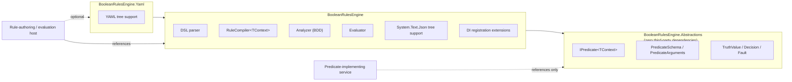
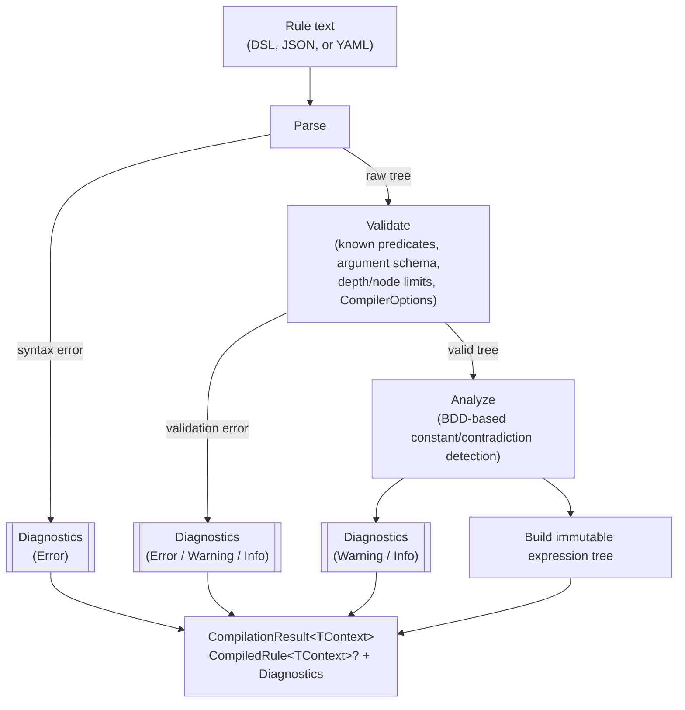

# BooleanRulesEngine

A general-purpose boolean expression engine for .NET. Author a rule once as
text, compile it into an immutable tree, and evaluate it many times against
whatever application context you supply — a user, a request, a resource, or
anything else.

> [!NOTE]
> This is a proof of concept. The design and rationale behind every decision
> below live in [CONTEXT.md](CONTEXT.md) and [docs/adr/](docs/adr/) — read
> those before making structural changes.

## What it is (and isn't)

`BooleanRulesEngine` answers one question: *is this expression true right
now, for this context?* It knows about `AND`, `OR`, `NOT`, `XOR`,
`ExactlyOne`, `AtLeast(k)`, terms, and evaluation. It does not know about
permissions, workflows, or policies — those are things you build *on top* of
it. A permission check ("can the current user do X") is one consumer of this
engine, not what the engine itself is.

| Concept | Meaning |
| --- | --- |
| **Rule** | A named unit of persistence: metadata + one expression. |
| **Expression** | The boolean tree — operators over terms and sub-expressions. |
| **Predicate** | A registered, reusable implementation, e.g. `hasRole`, `isManager`. |
| **Term** | A predicate bound to concrete arguments, e.g. `hasRole(role: "Y")` — the tree's leaf node. |
| **Operator** | `AND` `OR` `NOT` `XOR` `ExactlyOne` `AtLeast(k)`, plus `true`/`false`. |
| **Decision** | The evaluation result: a `TruthValue` plus any faults, and optionally a trace. |

Full vocabulary and the predicate-author contract: [CONTEXT.md](CONTEXT.md).

## Packages

| Package | Depends on | Ships |
| --- | --- | --- |
| `BooleanRulesEngine.Abstractions` | *(nothing third-party)* | `IPredicate<TContext>`, `PredicateSchema`, `PredicateArguments`, `TruthValue`, `Decision`, `Fault` — everything a predicate-implementing service needs. |
| `BooleanRulesEngine` | `Abstractions`, `Microsoft.Extensions.DependencyInjection.Abstractions`, `Microsoft.Extensions.Logging.Abstractions` | The DSL parser, `RuleCompiler<TContext>`, `CompiledRule<TContext>`, the BDD-based analyzer, the evaluator, `System.Text.Json` tree support, and DI registration extensions. |
| `BooleanRulesEngine.Yaml` | `BooleanRulesEngine`, YamlDotNet | YAML tree support (`CompileYaml`/`PrintYaml`), isolated so a consumer with no interest in YAML never pulls in YamlDotNet. |



A service that only *implements* domain predicates references
`Abstractions` alone — no parser, no BDD analyzer, no YAML library. See
[ADR-0004](docs/adr/0004-package-boundaries-and-extensibility.md).

## Example

Rule text (the canonical, persisted form):

```text
hasRole(role: "Y") AND (hasTraining(training: "Q") OR hasTraining(training: "Z") OR (isManager XOR isDepartmentHead))
```

The same rule as JSON (an interchange form — see
[ADR-0003](docs/adr/0003-rule-syntax-and-serialization.md)):

```json
{
  "op": "and",
  "operands": [
    { "predicate": "hasRole", "args": { "role": "Y" } },
    {
      "op": "or",
      "operands": [
        { "predicate": "hasTraining", "args": { "training": "Q" } },
        { "predicate": "hasTraining", "args": { "training": "Z" } },
        {
          "op": "xor",
          "operands": [
            { "predicate": "isManager" },
            { "predicate": "isDepartmentHead" }
          ]
        }
      ]
    }
  ]
}
```

...or the identical shape in YAML (`BooleanRulesEngine.Yaml`):

```yaml
op: and
operands:
  - predicate: hasRole
    args:
      role: "Y"
  - op: or
    operands:
      - predicate: hasTraining
        args:
          training: "Q"
      - predicate: hasTraining
        args:
          training: "Z"
      - op: xor
        operands:
          - predicate: isManager
          - predicate: isDepartmentHead
```

Registering predicates and evaluating:

```csharp
PredicateRegistry<User> registry = PredicateRegistry<User>.CreateBuilder()
    .Add<IsManager>()
    .Add<IsDepartmentHead>()
    .Add(
        new PredicateSchema("hasRole", [new PredicateArgumentSchema("role", LiteralKind.String)]),
        (user, args, ct) => ValueTask.FromResult(user.Roles.Contains(args.GetString("role"))))
    .Add(
        new PredicateSchema("hasTraining", [new PredicateArgumentSchema("training", LiteralKind.String)]),
        (user, args, ct) => ValueTask.FromResult(user.Training.Contains(args.GetString("training"))))
    .Build();

RuleCompiler<User> compiler = new(registry);
CompilationResult<User> result = compiler.Compile(ruleText);

if (!result.Succeeded)
{
    // Surface result.Diagnostics to whoever is authoring the rule.
    // The previously persisted rule (if any) stays active — see ADR-0002.
    return;
}

CompiledRule<User> rule = result.CompiledRule!;
Decision decision = await rule.EvaluateAsync(user, serviceProvider, cancellationToken: cancellationToken);

if (decision.IsSatisfied)
{
    // allowed
}
```

`IsManager`/`IsDepartmentHead` are class-based predicates (`IPredicate<User>`),
resolved fresh from `serviceProvider` on every call — the right shape for a
predicate with a scoped dependency such as a `DbContext`. `hasRole`/
`hasTraining` are stateless lambdas. Both forms register against the same
`PredicateRegistryBuilder<TContext>`; see
[ADR-0002](docs/adr/0002-evaluation-semantics.md#predicate-registration-and-dependency-lifetimes).

Wiring into a host's DI container instead of constructing things by hand:

```csharp
services.AddBooleanRulesEngine<User>(builder => builder
    .Add<IsManager>()
    .Add<IsDepartmentHead>());
```

## Evaluation flow


Short-circuit is real (an `AND` stops at the first `False`, an `OR` stops at
the first `True`) but the trace still records what was skipped, rather than
omitting it — the point of a trace is to explain a decision, and a hole
where an unevaluated branch should be defeats that. Faults don't abort
evaluation; they become `Unknown` and are absorbed wherever the operator's
truth table allows. Full reasoning: [ADR-0001](docs/adr/0001-kleene-failure-model.md)
and [ADR-0002](docs/adr/0002-evaluation-semantics.md).

## Compilation pipeline

Rule text — DSL, JSON, or YAML — all funnel through the same
Parse → Validate → Analyze → Build pipeline, which is why
`parse(print(x))` round-trips structurally regardless of which surface a
rule came from:



`Compile` never throws for an authoring error — every problem, from a
syntax error to a structural tautology, becomes a `Diagnostic` (code,
severity, source span) in the returned `CompilationResult<TContext>`.
`CompiledRule<TContext>` is populated only when there are no `Error`-severity
diagnostics, which is what makes "a bad edit is rejected, the previously
persisted rule stays active" true by construction rather than by convention.
Full reasoning: [ADR-0003](docs/adr/0003-rule-syntax-and-serialization.md).

## Feature highlights

- **Kleene three-valued logic.** `AND`/`OR`/`NOT`/`XOR`/`ExactlyOne`/
  `AtLeast(k)` all follow the three-valued truth tables in
  [ADR-0001](docs/adr/0001-kleene-failure-model.md) — a predicate fault
  becomes `Unknown`, never a thrown exception or a silently-coerced `false`.
- **Per-evaluation memoization.** A term referenced from multiple branches
  of the same rule is invoked at most once per evaluation, keyed by
  structural term identity (predicate name + sorted, type-normalized
  arguments — see [CONTEXT.md](CONTEXT.md#term-identity)).
- **A BDD-based analyzer**, not brute-force truth tables, flags structurally
  constant or contradictory sub-expressions (e.g.
  `hasRole(role: "Y") AND NOT hasRole(role: "Y")`) as compile diagnostics.
- **Resource limits and `CompilationMode.Lenient`.** `CompilerOptions`
  bounds tree depth, node count, and the analyzer's term cap so an
  admin-authored rule can't hang a request thread; `Lenient` mode compiles
  an unregistered predicate to a permanent `Unknown` term instead of an
  error, for services that share one rule store with different predicate
  sets registered.
- **`EvaluationOptions`**: an opt-in `FaultBudget` for fail-fast behavior
  during a known outage, an `Exhaustive` mode that runs every reachable term
  without changing the result (for "why was this denied" diagnostics), and
  an overall evaluation timeout linked into the caller's
  `CancellationToken`.
- **Scoped DI resolution.** Class-based predicates resolve fresh from the
  `IServiceProvider` supplied to each evaluation call, so a predicate with a
  scoped dependency works correctly even though a `CompiledRule<TContext>`
  is long-lived and shared.
- **Structured logging.** Faults, compile diagnostics, and rule-swap
  notifications log as structured events through `ILogger<T>` — never a
  concrete provider.

## Design documents

- [CONTEXT.md](CONTEXT.md) — vocabulary, conceptual model, predicate-author
  contract, and the list of deliberately deferred features.
- [ADR-0001: Kleene failure model](docs/adr/0001-kleene-failure-model.md) —
  why evaluation is three-valued internally and fails closed at the boundary.
- [ADR-0002: Evaluation semantics](docs/adr/0002-evaluation-semantics.md) —
  async predicates, per-evaluation memoization, short-circuit, fault
  handling, predicate registration, and the compile-and-swap rule lifecycle.
- [ADR-0003: Rule syntax and serialization](docs/adr/0003-rule-syntax-and-serialization.md) —
  the operator set, the DSL grammar, and the JSON/YAML tree form.
- [ADR-0004: Package boundaries and extensibility](docs/adr/0004-package-boundaries-and-extensibility.md) —
  why the library ships as three packages and how predicates and operators
  are extended.

## Repository layout

- `src/BooleanRulesEngine.Abstractions` — the zero-dependency kernel
- `src/BooleanRulesEngine` — parser, compiler, analyzer, evaluator, JSON, DI
- `src/BooleanRulesEngine.Yaml` — YAML tree support
- `tests/BooleanRulesEngine.Tests` — unit tests for all three packages
- `docs/adr/` — architecture decision records
- `CONTEXT.md` — domain vocabulary and model

See [CLAUDE.md](CLAUDE.md) for development rules, required validation
commands, and formatting/testing conventions.
