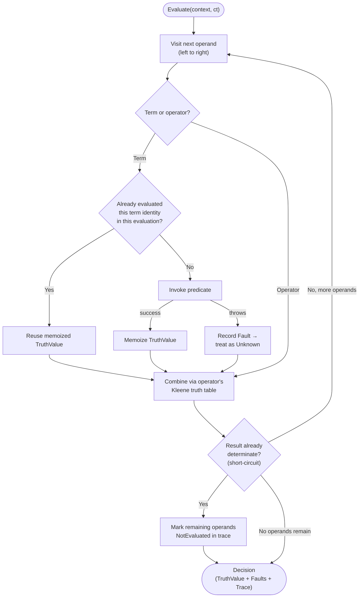

# BooleanRulesEngine

A general-purpose boolean expression engine for .NET. Author a rule once as
text, compile it into an immutable tree, and evaluate it many times against
whatever application context you supply — a user, a request, a resource, or
anything else.

> [!NOTE]
> This is a proof of concept. The design and rationale behind every decision
> below live in [CONTEXT.md](CONTEXT.md) and [docs/adr/](docs/adr/) — read
> those before making structural changes.

## What it is (and isn't)

`BooleanRulesEngine` answers one question: *is this expression true right
now, for this context?* It knows about `AND`, `OR`, `NOT`, `XOR`,
`ExactlyOne`, `AtLeast(k)`, terms, and evaluation. It does not know about
permissions, workflows, or policies — those are things you build *on top* of
it. A permission check ("can the current user do X") is one consumer of this
engine, not what the engine itself is.

| Concept | Meaning |
| --- | --- |
| **Rule** | A named unit of persistence: metadata + one expression. |
| **Expression** | The boolean tree — operators over terms and sub-expressions. |
| **Predicate** | A registered, reusable implementation, e.g. `hasRole`, `isManager`. |
| **Term** | A predicate bound to concrete arguments, e.g. `hasRole(role: "Y")` — the tree's leaf node. |
| **Operator** | `AND` `OR` `NOT` `XOR` `ExactlyOne` `AtLeast(k)`, plus `true`/`false`. |
| **Decision** | The evaluation result: a `TruthValue` plus any faults, and optionally a trace. |

Full vocabulary and the predicate-author contract: [CONTEXT.md](CONTEXT.md).

## Example

Rule text (the canonical, persisted form):

```text
hasRole(role: "Y") AND (hasTraining(training: "Q") OR hasTraining(training: "Z") OR (isManager XOR isDepartmentHead))
```

The same rule as JSON (an interchange form — see
[ADR-0003](docs/adr/0003-rule-syntax-and-serialization.md)):

```json
{
  "op": "and",
  "operands": [
    { "predicate": "hasRole", "args": { "role": "Y" } },
    {
      "op": "or",
      "operands": [
        { "predicate": "hasTraining", "args": { "training": "Q" } },
        { "predicate": "hasTraining", "args": { "training": "Z" } },
        {
          "op": "xor",
          "operands": [
            { "predicate": "isManager" },
            { "predicate": "isDepartmentHead" }
          ]
        }
      ]
    }
  ]
}
```

Registering predicates and evaluating:

```csharp
var registry = new PredicateRegistry();
registry.Register<IsManager>();
registry.Register<IsDepartmentHead>();
registry.Register("hasRole", (User user, PredicateArguments args) =>
    ValueTask.FromResult(user.Roles.Contains(args.GetString("role"))));
registry.Register("hasTraining", (User user, PredicateArguments args) =>
    ValueTask.FromResult(user.Training.Contains(args.GetString("training"))));

var compiler = new RuleCompiler(registry);
var result = compiler.Compile(ruleText);

if (!result.Succeeded)
{
    // Surface result.Diagnostics to whoever is authoring the rule.
    // The previously persisted rule (if any) stays active — see ADR-0002.
    return;
}

CompiledRule rule = result.Rule!;
Decision decision = await rule.EvaluateAsync(user, serviceProvider, cancellationToken);

if (decision.IsSatisfied)
{
    // allowed
}
```

## Evaluation flow



Short-circuit is real (an `AND` stops at the first `False`, an `OR` stops at
the first `True`) but the trace still records what was skipped, rather than
omitting it — the point of a trace is to explain a decision, and a hole
where an unevaluated branch should be defeats that. Faults don't abort
evaluation; they become `Unknown` and are absorbed wherever the operator's
truth table allows. Full reasoning: [ADR-0001](docs/adr/0001-kleene-failure-model.md)
and [ADR-0002](docs/adr/0002-evaluation-semantics.md).

## Design documents

- [CONTEXT.md](CONTEXT.md) — vocabulary, conceptual model, predicate-author
  contract, and the list of deliberately deferred features.
- [ADR-0001: Kleene failure model](docs/adr/0001-kleene-failure-model.md) —
  why evaluation is three-valued internally and fails closed at the boundary.
- [ADR-0002: Evaluation semantics](docs/adr/0002-evaluation-semantics.md) —
  async predicates, per-evaluation memoization, short-circuit, fault
  handling, predicate registration, and the compile-and-swap rule lifecycle.
- [ADR-0003: Rule syntax and serialization](docs/adr/0003-rule-syntax-and-serialization.md) —
  the operator set, the DSL grammar, and the JSON/YAML tree form.
- [ADR-0004: Package boundaries and extensibility](docs/adr/0004-package-boundaries-and-extensibility.md) —
  why the library ships as three packages and how predicates and operators
  are extended.

## Repository layout

- `src/BooleanRulesEngine` — production library
- `tests/BooleanRulesEngine.Tests` — unit tests
- `docs/adr/` — architecture decision records
- `CONTEXT.md` — domain vocabulary and model

See [CLAUDE.md](CLAUDE.md) for development rules, required validation
commands, and formatting/testing conventions.
