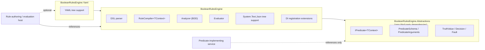
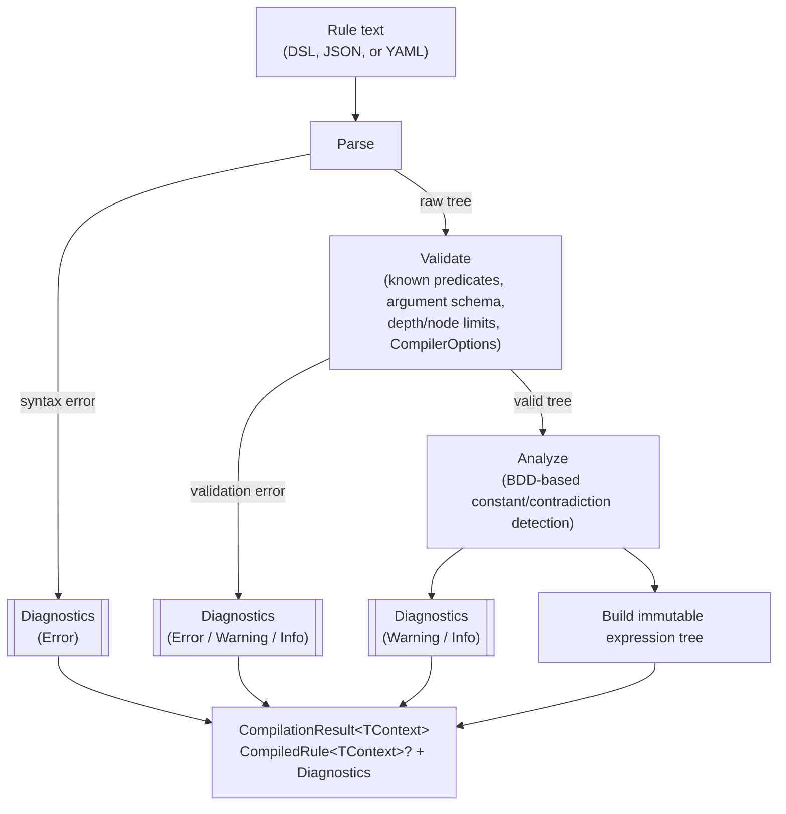

# BooleanRulesEngine

A general-purpose boolean expression engine for .NET. Author a rule once as
text, compile it into an immutable tree, and evaluate it many times against
whatever application context you supply — a user, a request, a resource, or
anything else.

> [!NOTE]
> This is a proof of concept. The design and rationale behind every decision
> below live in [CONTEXT.md](CONTEXT.md) and [docs/adr/](docs/adr/) — read
> those before making structural changes.

## Getting started

1. **Reference the packages you need.** A service that only *implements*
   predicates references `BooleanRulesEngine.Abstractions`; a host that
   authors and evaluates rules references `BooleanRulesEngine` (and
   `BooleanRulesEngine.Yaml` if it wants YAML too). See
   [Packages](#packages) below.

   ```xml
   <ProjectReference Include="..\BooleanRulesEngine\BooleanRulesEngine.csproj" />
   ```

2. **Implement a predicate.** A zero-argument predicate is the simplest
   shape — a class implementing `IPredicate<TContext>`:

   ```csharp
   public sealed class IsManager : IPredicate<User>
   {
       public static PredicateSchema Schema => PredicateSchema.NoArguments("isManager");

       public ValueTask<bool> EvaluateAsync(User user, PredicateArguments args, CancellationToken ct) =>
           ValueTask.FromResult(user.IsManager);
   }
   ```

3. **Register it and compile a rule:**

   ```csharp
   PredicateRegistry<User> registry = PredicateRegistry<User>.CreateBuilder().Add<IsManager>().Build();
   RuleCompiler<User> compiler = new(registry);
   CompilationResult<User> result = compiler.Compile("isManager");

   if (!result.Succeeded)
   {
       // result.Diagnostics explains why - surface it to whoever authored the rule.
       return;
   }
   ```

4. **Evaluate it against a context:**

   ```csharp
   Decision decision = await result.CompiledRule!.EvaluateAsync(user, serviceProvider, cancellationToken: ct);

   if (decision.IsSatisfied)
   {
       // allowed
   }
   ```

That's the whole lifecycle: implement → register → compile once → evaluate
many times. The [Examples](#examples) section below builds up from here to
named arguments, `AND`/`OR`/`XOR`/`AtLeast`, and the full ADR-0003 worked
example in DSL, JSON, and YAML.

## What it is (and isn't)

`BooleanRulesEngine` answers one question: *is this expression true right
now, for this context?* It knows about `AND`, `OR`, `NOT`, `XOR`,
`ExactlyOne`, `AtLeast(k)`, terms, and evaluation. It does not know about
permissions, workflows, or policies — those are things you build *on top* of
it. A permission check ("can the current user do X") is one consumer of this
engine, not what the engine itself is.

| Concept | Meaning |
| --- | --- |
| **Rule** | A named unit of persistence: metadata + one expression. |
| **Expression** | The boolean tree — operators over terms and sub-expressions. |
| **Predicate** | A registered, reusable implementation, e.g. `hasRole`, `isManager`. |
| **Term** | A predicate bound to concrete arguments, e.g. `hasRole(role: "Y")` — the tree's leaf node. |
| **Operator** | `AND` `OR` `NOT` `XOR` `ExactlyOne` `AtLeast(k)`, plus `true`/`false`. |
| **Decision** | The evaluation result: a `TruthValue` plus any faults, and optionally a trace. |

Full vocabulary and the predicate-author contract: [CONTEXT.md](CONTEXT.md).

## Packages

| Package | Depends on | Ships |
| --- | --- | --- |
| `BooleanRulesEngine.Abstractions` | *(nothing third-party)* | `IPredicate<TContext>`, `PredicateSchema`, `PredicateArguments`, `TruthValue`, `Decision`, `Fault` — everything a predicate-implementing service needs. |
| `BooleanRulesEngine` | `Abstractions`, `Microsoft.Extensions.DependencyInjection.Abstractions`, `Microsoft.Extensions.Logging.Abstractions` | The DSL parser, `RuleCompiler<TContext>`, `CompiledRule<TContext>`, the BDD-based analyzer, the evaluator, `System.Text.Json` tree support, and DI registration extensions. |
| `BooleanRulesEngine.Yaml` | `BooleanRulesEngine`, YamlDotNet | YAML tree support (`CompileYaml`/`PrintYaml`), isolated so a consumer with no interest in YAML never pulls in YamlDotNet. |



A service that only *implements* domain predicates references
`Abstractions` alone — no parser, no BDD analyzer, no YAML library. See
[ADR-0004](docs/adr/0004-package-boundaries-and-extensibility.md).

## Choosing a rule format

DSL, JSON, and YAML compile to the exact same tree through the exact same
Parse → Validate → Analyze → Build pipeline (see
[Compilation pipeline](#compilation-pipeline) below) — none of them is more
"real" than another at evaluation time. What differs is who's meant to
write and read each one:

| | DSL string | JSON tree | YAML tree |
| --- | --- | --- | --- |
| **Canonical / persisted form?** | Yes — this is what a `CompiledRule<TContext>` prints back to. | No — an interchange format. | No — an interchange format. |
| **Best for** | A human author or reviewer typing/reading a rule directly (a database column, a code review, a log line). | A UI rule builder generating or consuming a tree without writing a parser. | The same as JSON, when the host's tooling already prefers YAML (config files, GitOps). |
| **Package** | `BooleanRulesEngine` | `BooleanRulesEngine` | `BooleanRulesEngine.Yaml` |
| **Compile with** | `compiler.Compile(text)` | `compiler.CompileJson(json)` | `compiler.CompileYaml(yaml)` |
| **Print with** | `rule.CanonicalText` | `rule.PrintJson()` | `rule.PrintYaml()` |
| **Round-trips losslessly?** | Yes, by definition. | Yes — `parse(print(x))` is structurally equal to `x` (ticket 07). | Yes — same guarantee (ticket 08). |
| **Nesting for `AND`/`OR`/`XOR`** | Infix with precedence (`NOT` > `AND` > `OR`); `XOR` mixed with `AND`/`OR` needs explicit parens. | Explicit `{"op": "...", "operands": [...]}` nodes — no precedence to get wrong. | Same explicit `op`/`operands` shape as JSON. |
| **Comments** | No | No (JSON has none) | Yes (`#`) — a practical reason to prefer YAML for hand-maintained rule files. |

See [ADR-0003](docs/adr/0003-rule-syntax-and-serialization.md) for the full
grammar and tree schema.

## Examples

Five examples, each adding one more piece — a single predicate, combining
predicates, named arguments, the threshold operators, then the full worked
example in all three formats plus a bonus on turning a denial into a
human-readable sentence.

### 1. A single predicate

```text
isManager
```

```csharp
PredicateRegistry<User> registry = PredicateRegistry<User>.CreateBuilder().Add<IsManager>().Build();
RuleCompiler<User> compiler = new(registry);
CompiledRule<User> rule = compiler.Compile("isManager").CompiledRule!;

Decision decision = await rule.EvaluateAsync(user, serviceProvider, cancellationToken: ct);
```

### 2. Combining predicates: `AND` / `OR` / `NOT`

```text
isManager AND NOT isSuspended
```

`NOT` binds tighter than `AND`, which binds tighter than `OR`, so this
parses as `isManager AND (NOT isSuspended)` without needing parentheses.

### 3. Named arguments

```text
hasRole(role: "Y")
```

```csharp
PredicateRegistry<User> registry = PredicateRegistry<User>.CreateBuilder()
    .Add(
        new PredicateSchema("hasRole", [new PredicateArgumentSchema("role", LiteralKind.String)]),
        (user, args, ct) => ValueTask.FromResult(user.Roles.Contains(args.GetString("role"))))
    .Build();
```

Argument order in the source text never matters (`hasRole(role: "Y")` and a
predicate with several arguments written in any order compile to the same
term identity); argument *values* are case-sensitive (`"Y"` and `"y"` are
different terms — see [CONTEXT.md#term-identity](CONTEXT.md#term-identity)).

### 4. `XOR`, `ExactlyOne`, and `AtLeast`

```text
AtLeast(2, approvedByAlice, approvedByBob, approvedByCarol)
```

"At least two of these three approvals." `ExactlyOne(a, b, c)` is the n-ary
"exactly one of these" operator; `XOR` is deliberately binary-only — use
`ExactlyOne` once you need more than two operands, rather than relying on
`XOR`'s parity-generalization (which is almost never what an author means
past two operands — see [ADR-0003](docs/adr/0003-rule-syntax-and-serialization.md)).

### 5. The full worked example, in all three formats

Rule text (the canonical, persisted form):

```text
hasRole(role: "Y") AND (hasTraining(training: "Q") OR hasTraining(training: "Z") OR (isManager XOR isDepartmentHead))
```

The same rule as JSON:

```json
{
  "op": "and",
  "operands": [
    { "predicate": "hasRole", "args": { "role": "Y" } },
    {
      "op": "or",
      "operands": [
        { "predicate": "hasTraining", "args": { "training": "Q" } },
        { "predicate": "hasTraining", "args": { "training": "Z" } },
        {
          "op": "xor",
          "operands": [
            { "predicate": "isManager" },
            { "predicate": "isDepartmentHead" }
          ]
        }
      ]
    }
  ]
}
```

...and in YAML (`BooleanRulesEngine.Yaml`):

```yaml
op: and
operands:
  - predicate: hasRole
    args:
      role: "Y"
  - op: or
    operands:
      - predicate: hasTraining
        args:
          training: "Q"
      - predicate: hasTraining
        args:
          training: "Z"
      - op: xor
        operands:
          - predicate: isManager
          - predicate: isDepartmentHead
```

Registering predicates and evaluating:

```csharp
PredicateRegistry<User> registry = PredicateRegistry<User>.CreateBuilder()
    .Add<IsManager>()
    .Add<IsDepartmentHead>()
    .Add(
        new PredicateSchema("hasRole", [new PredicateArgumentSchema("role", LiteralKind.String)]),
        (user, args, ct) => ValueTask.FromResult(user.Roles.Contains(args.GetString("role"))))
    .Add(
        new PredicateSchema("hasTraining", [new PredicateArgumentSchema("training", LiteralKind.String)]),
        (user, args, ct) => ValueTask.FromResult(user.Training.Contains(args.GetString("training"))))
    .Build();

RuleCompiler<User> compiler = new(registry);
CompilationResult<User> result = compiler.Compile(ruleText);

if (!result.Succeeded)
{
    // Surface result.Diagnostics to whoever is authoring the rule.
    // The previously persisted rule (if any) stays active — see ADR-0002.
    return;
}

CompiledRule<User> rule = result.CompiledRule!;
Decision decision = await rule.EvaluateAsync(user, serviceProvider, cancellationToken: cancellationToken);

if (decision.IsSatisfied)
{
    // allowed
}
```

`IsManager`/`IsDepartmentHead` are class-based predicates (`IPredicate<User>`),
resolved fresh from `serviceProvider` on every call — the right shape for a
predicate with a scoped dependency such as a `DbContext`. `hasRole`/
`hasTraining` are stateless lambdas. Both forms register against the same
`PredicateRegistryBuilder<TContext>`; see
[ADR-0002](docs/adr/0002-evaluation-semantics.md#predicate-registration-and-dependency-lifetimes).

Wiring into a host's DI container instead of constructing things by hand:

```csharp
services.AddBooleanRulesEngine<User>(builder => builder
    .Add<IsManager>()
    .Add<IsDepartmentHead>());
```

### Bonus: explaining a denied decision

`Decision`/`Fault`/`Trace` give you the *structured* reason for a denial;
turning that into a sentence for an end user or a support ticket is the
host's job. [Humanizer](https://github.com/Humanizr/Humanizer) is a
convenient pairing — predicate names are already camelCase words, and fault
counts are already numbers:

```csharp
using Humanizer;

if (!decision.IsSatisfied && decision.Faults.Count > 0)
{
    string summary = decision.Faults.Count.ToQuantity("predicate");
    Console.WriteLine($"Couldn't reach a decision: {summary} failed to answer.");

    foreach (Fault fault in decision.Faults)
    {
        // "hasRole" -> "has role"
        Console.WriteLine($"  - {fault.Term.PredicateName.Humanize()}: {fault.Exception.Message}");
    }
}
```

## Evaluation flow


Short-circuit is real (an `AND` stops at the first `False`, an `OR` stops at
the first `True`) but the trace still records what was skipped, rather than
omitting it — the point of a trace is to explain a decision, and a hole
where an unevaluated branch should be defeats that. Faults don't abort
evaluation; they become `Unknown` and are absorbed wherever the operator's
truth table allows. Full reasoning: [ADR-0001](docs/adr/0001-kleene-failure-model.md)
and [ADR-0002](docs/adr/0002-evaluation-semantics.md).

## Compilation pipeline

Rule text — DSL, JSON, or YAML — all funnel through the same
Parse → Validate → Analyze → Build pipeline, which is why
`parse(print(x))` round-trips structurally regardless of which surface a
rule came from:



`Compile` never throws for an authoring error — every problem, from a
syntax error to a structural tautology, becomes a `Diagnostic` (code,
severity, source span) in the returned `CompilationResult<TContext>`.
`CompiledRule<TContext>` is populated only when there are no `Error`-severity
diagnostics, which is what makes "a bad edit is rejected, the previously
persisted rule stays active" true by construction rather than by convention.
Full reasoning: [ADR-0003](docs/adr/0003-rule-syntax-and-serialization.md).

## Feature highlights

- **Kleene three-valued logic.** `AND`/`OR`/`NOT`/`XOR`/`ExactlyOne`/
  `AtLeast(k)` all follow the three-valued truth tables in
  [ADR-0001](docs/adr/0001-kleene-failure-model.md) — a predicate fault
  becomes `Unknown`, never a thrown exception or a silently-coerced `false`.
- **Per-evaluation memoization.** A term referenced from multiple branches
  of the same rule is invoked at most once per evaluation, keyed by
  structural term identity (predicate name + sorted, type-normalized
  arguments — see [CONTEXT.md](CONTEXT.md#term-identity)).
- **A BDD-based analyzer**, not brute-force truth tables, flags structurally
  constant or contradictory sub-expressions (e.g.
  `hasRole(role: "Y") AND NOT hasRole(role: "Y")`) as compile diagnostics.
- **Resource limits and `CompilationMode.Lenient`.** `CompilerOptions`
  bounds tree depth, node count, and the analyzer's term cap so an
  admin-authored rule can't hang a request thread; `Lenient` mode compiles
  an unregistered predicate to a permanent `Unknown` term instead of an
  error, for services that share one rule store with different predicate
  sets registered.
- **`EvaluationOptions`**: an opt-in `FaultBudget` for fail-fast behavior
  during a known outage, an `Exhaustive` mode that runs every reachable term
  without changing the result (for "why was this denied" diagnostics), and
  an overall evaluation timeout linked into the caller's
  `CancellationToken`.
- **Scoped DI resolution.** Class-based predicates resolve fresh from the
  `IServiceProvider` supplied to each evaluation call, so a predicate with a
  scoped dependency works correctly even though a `CompiledRule<TContext>`
  is long-lived and shared.
- **Structured logging.** Faults, compile diagnostics, and rule-swap
  notifications log as structured events through `ILogger<T>` — never a
  concrete provider.

## Glossary

The short version lives in the [concept table](#what-it-is-and-isnt) above;
this is the full vocabulary, alphabetically. The authoritative version,
with the reasoning behind each term, is [CONTEXT.md](CONTEXT.md).

| Term | Meaning |
| --- | --- |
| `AtLeast(k, ...)` | N-ary threshold operator: true iff at least `k` of the operands are true (e.g. "any two of these three approvals"). |
| BDD analyzer | The compiler's constant/contradiction-detection pass, backed by a real binary decision diagram rather than brute-force truth tables — see [Compilation pipeline](#compilation-pipeline). |
| `CompilationMode` | `Strict` (default — an unregistered predicate is a compile error) or `Lenient` (an unregistered predicate compiles to a permanent `Unknown` term, for services sharing a rule store with different predicate sets). |
| `CompilationResult<TContext>` | What `Compile`/`CompileJson`/`CompileYaml` return: a nullable `CompiledRule<TContext>` plus every `Diagnostic` raised. |
| `CompiledRule<TContext>` | The immutable, thread-safe result of a successful compile. Safe to cache, share, and evaluate repeatedly; swapping the reference that holds it is how a host applies a rule edit at runtime. |
| `CompilerOptions` | Compile-time resource bounds — max tree depth, max node count, the BDD analyzer's term cap — plus `CompilationMode`. |
| `Decision` | The result of one evaluation: a `TruthValue`, the `Fault`s absorbed along the way, and optionally a `Trace`. `Decision.IsSatisfied` is true only when the result is `TruthValue.True`. |
| `Diagnostic` | One compile-time problem: a code, a `DiagnosticSeverity` (`Error`/`Warning`/`Info`), a message, and a source span. `Error` severity is what blocks `CompiledRule<TContext>` from being populated. |
| `EvaluationOptions` | Per-call evaluation knobs: `FaultBudget` (abort after N faults), `Mode` (`Default` or `Exhaustive`), and an overall timeout. |
| `ExactlyOne(...)` | N-ary operator: true iff exactly one operand is true. The explicit name for "exactly one," so it's never confused with `XOR`'s binary-only meaning. |
| Expression | The boolean tree itself — operators over terms and sub-expressions. What a `CompiledRule<TContext>` wraps. |
| `Fault` | A record of one predicate failing to produce an answer during one evaluation: the faulting term's identity plus the exception. Faults are absorbed as `Unknown`, never rethrown. |
| Kleene logic | Three-valued logic (`True`/`False`/`Unknown`) instead of two-valued boolean logic — the reason a predicate fault becomes `Unknown` rather than a thrown exception or a silently-coerced `false`. See [ADR-0001](docs/adr/0001-kleene-failure-model.md). |
| Memoization | Within one evaluation, a given term identity is invoked at most once, however many places in the tree reference it. Never carries across separate `EvaluateAsync` calls. |
| Operator | `AND`, `OR`, `NOT`, `XOR`, `ExactlyOne`, `AtLeast(k)`, and the `true`/`false` constants — the closed set of ways to combine terms and sub-expressions. |
| Predicate | A registered, reusable implementation (e.g. `hasRole`, `isManager`) — the *function*, not any one call to it. Implements `IPredicate<TContext>` or is registered as a stateless lambda. |
| `PredicateArguments` | The non-generic accessor (`GetString`, `GetInt64`, ...) a predicate uses to read its own term's arguments inside `EvaluateAsync`. |
| `PredicateRegistry<TContext>` | Where predicates are registered under a name, with their `PredicateSchema`. Built once via `PredicateRegistryBuilder<TContext>`; no attribute or assembly scanning. |
| `PredicateSchema` | A predicate's registered name and its named-argument declarations, validated against a term's arguments at compile time. |
| Rule | A named unit of persistence: metadata plus one expression. What gets compiled into a `CompiledRule<TContext>`. |
| Short-circuit | `AND` stops evaluating operands at the first `False`; `OR` stops at the first `True`. Skipped operands are recorded as `NotEvaluated` in the trace, not omitted. |
| Term | A predicate bound to concrete, literal arguments (e.g. `hasRole(role: "Y")`) — the tree's leaf node, and the unit of memoization. |
| Term identity | What makes two term references "the same variable": predicate name (normalized to registered casing) plus arguments sorted by name and compared by exact, case-sensitive value. Argument order in source text never matters; array-valued arguments are order-sensitive. |
| `Trace` | An ordered, literal record of every node an evaluation visited or explicitly skipped — the "why was this denied" explanation. |
| `TruthValue` | The three-valued result type: `True`, `False`, or `Unknown`. Never `bool?`. |
| `XOR(a, b)` | Binary exclusive-or, deliberately not generalized to n-ary parity. Mixing `XOR` with `AND`/`OR` at the same level without parentheses is a compile error — see [Examples #4](#4-xor-exactlyone-and-atleast). |

## Design documents

- [CONTEXT.md](CONTEXT.md) — vocabulary, conceptual model, predicate-author
  contract, and the list of deliberately deferred features.
- [ADR-0001: Kleene failure model](docs/adr/0001-kleene-failure-model.md) —
  why evaluation is three-valued internally and fails closed at the boundary.
- [ADR-0002: Evaluation semantics](docs/adr/0002-evaluation-semantics.md) —
  async predicates, per-evaluation memoization, short-circuit, fault
  handling, predicate registration, and the compile-and-swap rule lifecycle.
- [ADR-0003: Rule syntax and serialization](docs/adr/0003-rule-syntax-and-serialization.md) —
  the operator set, the DSL grammar, and the JSON/YAML tree form.
- [ADR-0004: Package boundaries and extensibility](docs/adr/0004-package-boundaries-and-extensibility.md) —
  why the library ships as three packages and how predicates and operators
  are extended.

## Repository layout

- `src/BooleanRulesEngine.Abstractions` — the zero-dependency kernel
- `src/BooleanRulesEngine` — parser, compiler, analyzer, evaluator, JSON, DI
- `src/BooleanRulesEngine.Yaml` — YAML tree support
- `tests/BooleanRulesEngine.Tests` — unit tests for all three packages
- `docs/adr/` — architecture decision records
- `CONTEXT.md` — domain vocabulary and model

See [CLAUDE.md](CLAUDE.md) for development rules, required validation
commands, and formatting/testing conventions.
