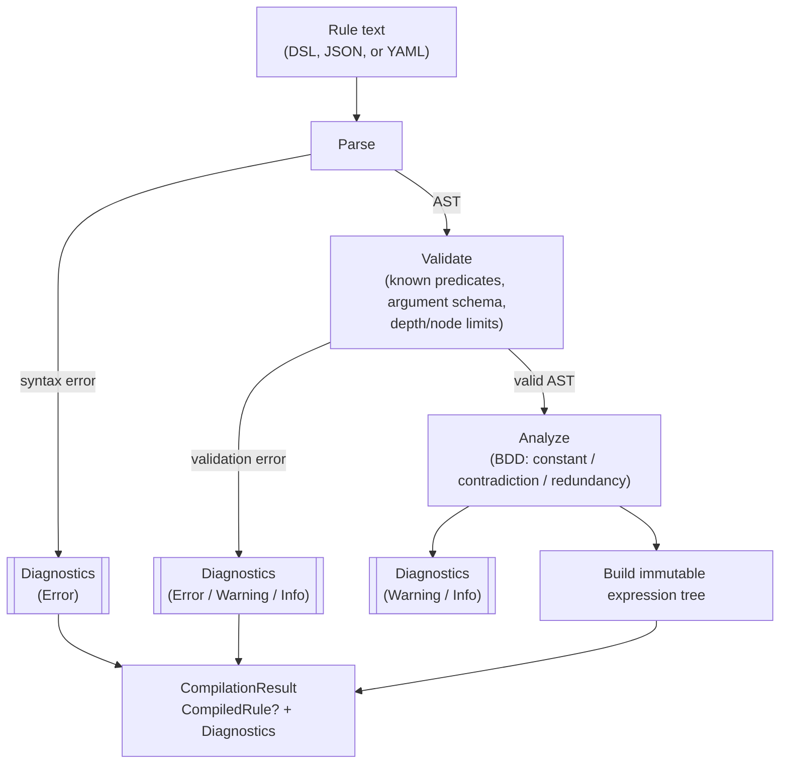
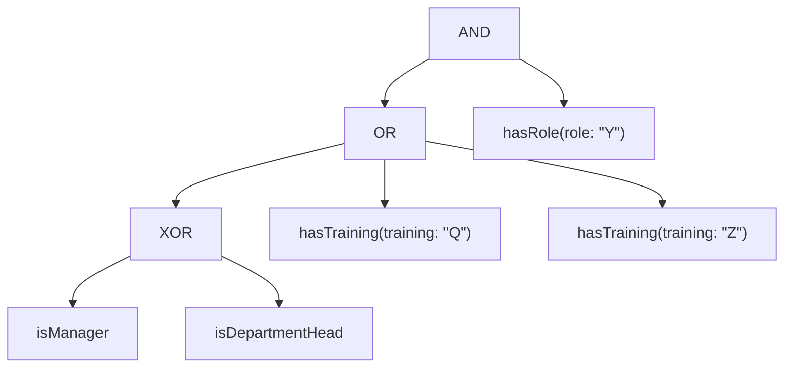

# ADR-0003: Rule syntax and serialization

## Status

Accepted

## Context

A rule needs at least one human-editable textual form and at least one
tree-shaped form that's easy to generate programmatically (e.g. from a UI
rule builder) and easy to validate structurally. Three surfaces were on the
table: a string DSL, a JSON tree, and YAML. They need to agree, byte-for-byte
in meaning, on: operator precedence and grouping, how terms take arguments,
and which one is authoritative for persistence.

Two specific traps drove several of the decisions below:

- **Precedence vs. explicitness.** A rule language that requires
  parenthesizing every operator combination is unpleasant to author by hand;
  one that relies purely on implicit precedence for *persisted, machine-read*
  structure is fragile and error-prone to reason about. These pull in
  opposite directions unless separated: precedence can safely govern
  *parsing*, as long as the canonical *printed* form always disambiguates
  explicitly.
- **N-ary XOR is not what people mean.** The parity generalization of binary
  XOR (odd number of `true` operands) is the algebraically "correct"
  extension to more than two operands, but it is almost never what an author
  writing `XOR(a, b, c)` intends — they mean *exactly one*. Silently
  resolving that ambiguity one way is a latent bug generator.

## Decision

### Operator set

`AND`, `OR`, `NOT`, `XOR` (**binary only** — a compile error if given more
than two operands), `ExactlyOne(...)` (n-ary, true iff exactly one operand is
`True`), `AtLeast(k, ...)` (n-ary threshold, e.g. "any two of these three
approvals"), and the constants `true`/`false`.

`IMPLIES` is deliberately **not** included — it saves two characters over
`OR(NOT(a), b)` and rule authors reliably get its truth table wrong, so the
"convenience" is negative value. N-ary `XOR` is not supported under that
name at all — the ambiguity above is resolved by giving the "exactly one"
meaning its own explicit name (`ExactlyOne`) instead of overloading `XOR`.

### String DSL — canonical form

Word operators only (`AND`, `OR`, `NOT`, `XOR`, `ExactlyOne`, `AtLeast`),
matched case-insensitively on input. No symbol aliases (`&&`, `||`) — one
syntax is one thing to document, parse, and test, and rules will often be
authored or reviewed by people who are not C# developers and have no
existing attachment to C-style operators.

Precedence for parsing: `NOT` > `AND` > `OR`. **Mixing `XOR` with `AND`/`OR`
without parentheses is a compile error**, not resolved by a precedence rule
— nobody's intuition about `a AND b XOR c` is reliable enough to make an
implicit answer safe. Zero-argument terms are written bare (`isManager`, not
`isManager()`).

Arguments are **named, never positional**, in both the DSL and the tree
forms — `hasRole(role: "Y")`. This removes the inconsistency in the original
draft (JSON used named arguments, the string sketch used positional), and it
lets each predicate declare an explicit argument schema (name, type,
required/default) that the compiler validates once, at compile time, so a
missing or mistyped argument can never surface as a runtime failure inside a
predicate.

Argument values are **literals only**, from a closed set of types: `string`,
`long`, `decimal`, `bool`, `DateTimeOffset`, and arrays of those. There is no
`{{handlebar}}` or path-expression syntax referencing the evaluation context
from within a rule string — a rule needing something like "the resource's
owner id" defines a predicate that reaches into its own `TContext` for that
value (e.g. `IsManagerOfResourceOwner`), rather than the rule text expressing
a context path. This is deliberate: context-bound argument values are
tempting but (a) require a real typed path-expression grammar to do safely,
and (b) break static, structural rule-to-rule equality, since two "same
shaped" rules would no longer be comparable without also evaluating what
their path expressions resolve to. See
[CONTEXT.md](../../CONTEXT.md#deferred) for this as a deferred, not
rejected, feature.

The canonical printer (the form a `CompiledRule` round-trips back to)
emits **minimal but unambiguous** parentheses — it always parenthesizes
`XOR` explicitly and is deterministic (the same tree always prints
identically), so canonical printed forms can be diffed and compared directly.

Example:

```
hasRole(role: "Y") AND (hasTraining(training: "Q") OR hasTraining(training: "Z") OR (isManager XOR isDepartmentHead))
```

### JSON / YAML — interchange, not canonical

JSON and YAML are **interchange and tooling formats**, not the persisted
form. Both compile to exactly the same AST as the DSL, and the guarantee
that matters is: `parse(print(x))` is structurally equal to `x`, in both
directions, for every supported form. This makes JSON/YAML suitable for a
UI rule builder to generate and consume without needing a parser, while the
DSL string remains what actually gets written to a database column (compact,
diff-friendly, one column, readable directly in a log line).

The tree shape drops the original draft's `{"term": {...}}` wrapper nesting
in favor of a flat, key-discriminated node:

```json
{
  "op": "and",
  "operands": [
    { "predicate": "hasRole", "args": { "role": "Y" } },
    {
      "op": "or",
      "operands": [
        { "predicate": "hasTraining", "args": { "training": "Q" } },
        { "predicate": "hasTraining", "args": { "training": "Z" } },
        {
          "op": "xor",
          "operands": [
            { "predicate": "isManager" },
            { "predicate": "isDepartmentHead" }
          ]
        }
      ]
    }
  ]
}
```

A node is discriminated by which key is present (`op` vs. `predicate`)
rather than by an extra wrapper object, halving the nesting depth for the
same information. YAML uses the identical shape under YamlDotNet.

The `true`/`false` constant (user story 11) uses the same discrimination
principle with a third key: `{"const": true}` / `{"const": false}`.

### Compilation pipeline



`Compile` always returns a `CompilationResult`; it never throws for anything
on this diagram. `CompiledRule` is populated only when there are no
`Error`-severity diagnostics. See
[ADR-0002](0002-evaluation-semantics.md#persisted-rules-and-compile-failures)
for how this integrates with persistence.

### Expression tree shape

The worked example from the original spec, shown as the tree the compiler
actually builds (identical regardless of which surface — DSL, JSON, or YAML
— it was parsed from):



## Consequences

- Authors write and review one string form; UI tooling generates and
  consumes tree forms; both are provably the same rule via round-trip
  equality, so there's no "which format is real" ambiguity.
- Because `XOR` cannot silently extend past two operands, and cannot be
  silently mixed with `AND`/`OR`, an entire class of "the rule author
  probably meant something else" bugs is turned into a compile-time
  diagnostic instead of a runtime surprise.
- Because argument values are closed-set literals with no context-path
  syntax, canonical rule equality (used by the analyzer for constant and
  contradiction detection, per [CONTEXT.md](../../CONTEXT.md#term-identity))
  remains a pure structural/value comparison with no evaluation semantics
  entangled in it.
- A predicate needing a value from the evaluation context must be authored
  as a distinct, named predicate rather than parameterized generically from
  a path expression — more predicates to register, but each one is fully
  inspectable and testable in isolation.

## Related

- [ADR-0001: Kleene failure model](0001-kleene-failure-model.md)
- [ADR-0002: Evaluation semantics](0002-evaluation-semantics.md)
- [CONTEXT.md](../../CONTEXT.md)
