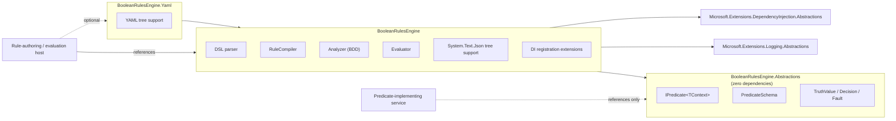

# ADR-0004: Package boundaries and extensibility

## Status

Accepted

## Context

Predicate implementations frequently need to live in a different deployment
unit than the engine itself — a shared "kernel" of domain predicates
(`isManager`, `hasRole`, `customerHasCredit`) referenced from several
services, none of which necessarily want to depend on a rule parser, a BDD-
based analyzer, or a YAML library just to *implement and register*
predicates. Getting the package split wrong in v1 means either an
unnecessarily heavy dependency for predicate-only consumers, or a breaking
split later once real consumers already depend on a single monolithic
package.

A related, narrower question: what should this library log through, given
this repo's own rule against unnecessary dependencies and given the
project's observability story is intentionally minimal for the proof of
concept (see [CONTEXT.md](../../CONTEXT.md#deferred) — OpenTelemetry-shaped
observability is deferred, not v1).

## Decision

### Three packages

- **`BooleanRulesEngine.Abstractions`** — `IPredicate<TContext>`,
  `PredicateSchema`, `PredicateArguments`, `TruthValue`, `Decision`, `Fault`.
  Zero third-party dependencies. This is the "common kernel" a project that
  only *implements* predicates references — it does not need the parser, the
  compiler, the analyzer, or any serialization support.
- **`BooleanRulesEngine`** — the AST, DSL parser, `RuleCompiler`,
  `CompiledRule`, the analyzer (BDD-based constant/contradiction/redundancy
  detection), the evaluator, `System.Text.Json` support for the JSON tree
  form, and dependency-injection registration extensions. Depends on
  `Microsoft.Extensions.DependencyInjection.Abstractions` and
  `Microsoft.Extensions.Logging.Abstractions` (see below) — nothing else.
- **`BooleanRulesEngine.Yaml`** — YAML tree support, isolated here because
  it is the one place YamlDotNet is needed, and a consumer with no interest
  in YAML should not acquire that dependency transitively.

Splitting a monolithic package into these three later is a breaking change
for anyone who already depends on the combined surface; shipping the split
from the start costs nothing extra now.

### Logging: abstractions, not a concrete provider

The library depends on `Microsoft.Extensions.Logging.Abstractions` and logs
through `ILogger<T>` — never a concrete provider such as Serilog. The
consuming application wires whatever provider it already uses (Serilog or
otherwise) to the `ILogger` the library requests; the library itself commits
to nothing beyond the abstraction. v1's logging is intentionally simple:
faults, compile diagnostics, and rule-swap events are logged as structured
log events. This is explicitly a stepping stone — a later OpenTelemetry-
shaped observability story (an `Activity` per rule evaluation, an event per
term, fault attributes) can be added on top of `ILogger`-based logging
without a breaking change, and is tracked as deferred in
[CONTEXT.md](../../CONTEXT.md#deferred) rather than built now.

### Extensibility: explicit registration only

New predicates are added by explicit registration against the
`PredicateRegistry` — either implementing `IPredicate<TContext>` and
registering the type (resolved per-evaluation from `IServiceProvider`, so
scoped dependencies work correctly per
[ADR-0002](0002-evaluation-semantics.md#predicate-registration-and-dependency-lifetimes)),
or registering a stateless lambda directly. There is no attribute-scanning
or assembly-scanning discovery mechanism. New *operators* are added inside
`BooleanRulesEngine` itself (parser, compiler, evaluator, analyzer each
need to know about a new operator) rather than through an operator plugin
model — the operator set is small and closed by design
([ADR-0003](0003-rule-syntax-and-serialization.md)), so an extensibility
point for operators would be speculative surface area with no current
consumer.

### Amendment: `RuleBuilder` is not a fourth front end

`RuleBuilder` (`BooleanRulesEngine.Building`, added after this ADR was first
accepted) lets a host assemble a rule tree fluently in C#. It lives inside
`BooleanRulesEngine` itself rather than as a separate package or an
extension point some other assembly could plug into: it renders to the same
JSON tree shape [ADR-0003](0003-rule-syntax-and-serialization.md) already
defines and compiles through the existing `CompileJson`, so it's a
convenience wrapper over the closed operator set above, not a new surface
that would need to independently track every operator this package adds.

## Consequences

- A service that only implements domain predicates (e.g. a shared
  "permissions kernel" referenced by several microservices) takes a
  dependency with no parser, no BDD analyzer, and no YAML library — just the
  interfaces and value types it actually needs to implement against.
- Adding YAML support to a project that doesn't want it costs nothing;
  removing the dependency is impossible to need since it was never forced.
- Swapping the logging provider (Serilog, or anything else) is entirely the
  host application's concern and requires no change to this library.
- Because the operator set is closed and lives inside the core package,
  adding a new operator is a versioned change to `BooleanRulesEngine` itself,
  not a third-party extension point — consistent with "do not introduce
  unnecessary abstractions."

## Related

- [ADR-0002: Evaluation semantics](0002-evaluation-semantics.md)
- [ADR-0003: Rule syntax and serialization](0003-rule-syntax-and-serialization.md)
- [CONTEXT.md](../../CONTEXT.md)
